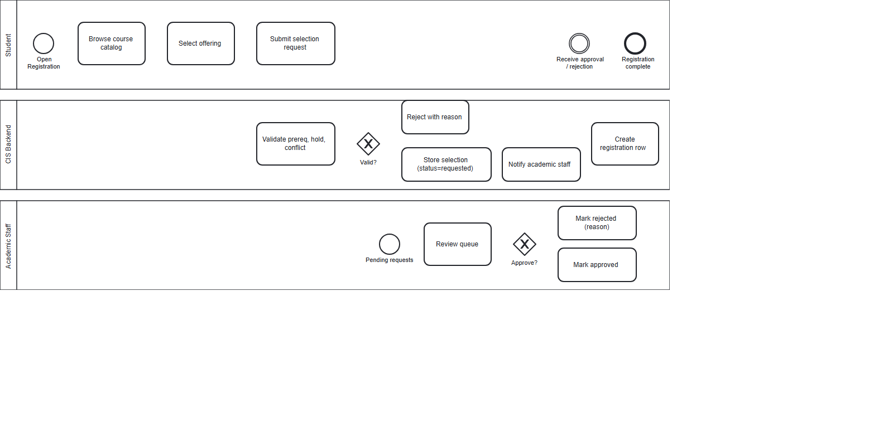
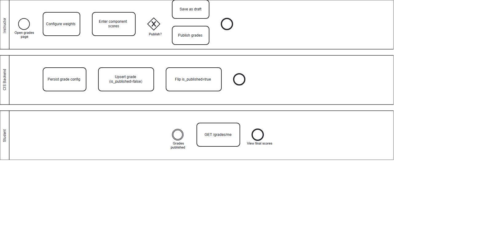
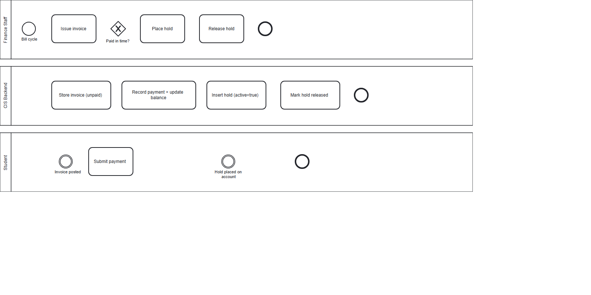
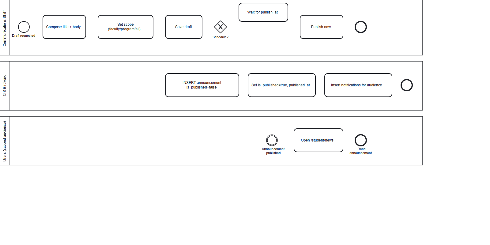
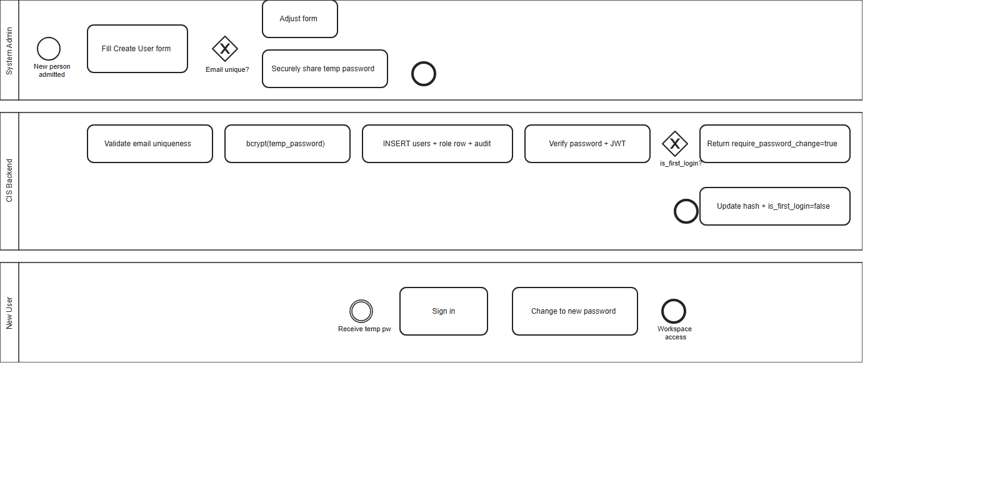

# CIS — Business Process (BPMN) Diagrams

Five BPMN 2.0 collaboration diagrams covering the core institutional business processes of CIS. Each diagram includes pools, lanes, message flows, gateways, and end events per BPMN 2.0 notation.

| # | Process | Source | SVG | PNG |
|---|---|---|---|---|
| 1 | Course registration (selection → approval → registration) | [01-course-registration.bpmn](01-course-registration.bpmn) | [SVG](01-course-registration.svg) | [PNG](01-course-registration.png) |
| 2 | Grade publication (configure → enter → publish → student view) | [02-grade-publication.bpmn](02-grade-publication.bpmn) | [SVG](02-grade-publication.svg) | [PNG](02-grade-publication.png) |
| 3 | Invoice → payment → hold → release | [03-invoice-payment-hold.bpmn](03-invoice-payment-hold.bpmn) | [SVG](03-invoice-payment-hold.svg) | [PNG](03-invoice-payment-hold.png) |
| 4 | Announcement publication & broadcast | [04-announcement-broadcast.bpmn](04-announcement-broadcast.bpmn) | [SVG](04-announcement-broadcast.svg) | [PNG](04-announcement-broadcast.png) |
| 5 | User onboarding (admin provisioning → first login → password change) | [05-user-onboarding.bpmn](05-user-onboarding.bpmn) | [SVG](05-user-onboarding.svg) | [PNG](05-user-onboarding.png) |

## Viewing

- **In the browser / GitHub**: click any `.svg` link above — they render inline.
- **As fallback / for printing**: each `.png` is a static raster of the same diagram.
- **For editing**: open any `.bpmn` file in [bpmn.io](https://bpmn.io/) (drag & drop), the Camunda Modeler, or any BPMN 2.0–compliant tool. The XML is valid BPMN 2.0.

## Diagram 1 — Course Registration

**Pools:** Student · CIS Backend · Academic Staff

**Flow summary:** Student browses catalog → submits selection → backend validates (prereq / hold / conflict) → stores as `requested` → notifies academic staff → staff approves/rejects → on approval, backend creates a `registrations` row and notifies the student.

**Maps to:** [docs/roles/student/sequence-diagrams.md#S2](../roles/student/sequence-diagrams.md), [docs/roles/academic-staff/sequence-diagrams.md#S1](../roles/academic-staff/sequence-diagrams.md), backend [course_selections.py](../../backend/src/routes/course_selections.py).

## Diagram 2 — Grade Publication

**Pools:** Instructor · CIS Backend · Student

**Flow summary:** Instructor configures weight components → enters per-registration component scores (saved as `is_published=false`) → chooses to publish now or later → on publish, backend flips `is_published=true` → student views final scores via `GET /grades/me`.

**Maps to:** [docs/roles/instructor/sequence-diagrams.md#S3](../roles/instructor/sequence-diagrams.md), backend [grades.py](../../backend/src/routes/grades.py).

## Diagram 3 — Invoice → Payment → Hold

**Pools:** Finance Staff · CIS Backend · Student

**Flow summary:** Finance issues invoice → student receives → if paid in time, end. If overdue, finance places hold (which the backend then enforces against new course-selection submissions) → after payment, finance releases hold.

**Maps to:** [docs/roles/finance-staff/sequence-diagrams.md#S2](../roles/finance-staff/sequence-diagrams.md), backend [finance.py](../../backend/src/routes/finance.py).

## Diagram 4 — Announcement Publication

**Pools:** Communications Staff · CIS Backend · Users (scoped audience)

**Flow summary:** Comms staff composes title + body + scope → saves draft → chooses to publish now or schedule → on publish, backend flips `is_published=true` and writes notifications targeted at the configured scope (all / faculty / program) → users see the announcement at `/student/news` and in their inbox.

**Maps to:** [docs/roles/communications-staff/sequence-diagrams.md#S1](../roles/communications-staff/sequence-diagrams.md), backend [communications.py](../../backend/src/routes/communications.py).

## Diagram 5 — User Onboarding

**Pools:** System Admin · CIS Backend · New User

**Flow summary:** Admin fills create-user form → backend validates email uniqueness → bcrypt-hashes temp password → inserts users + role-specific row → records audit log → admin securely shares credentials → user signs in → backend returns `require_password_change=true` → user changes password → `is_first_login` flips to false → normal workspace access.

**Maps to:** [docs/roles/system-admin/sequence-diagrams.md#S1](../roles/system-admin/sequence-diagrams.md), backend [users.py](../../backend/src/routes/users.py) + [auth.py](../../backend/src/routes/auth.py).

## Notation cheat sheet (BPMN 2.0)

| Symbol | Meaning |
|---|---|
| Circle (thin border) | Start event |
| Circle (double border) | Intermediate event (message catch) |
| Circle (thick border) | End event |
| Rounded rectangle | Task / activity |
| Diamond | Gateway (exclusive XOR by default) |
| Solid arrow | Sequence flow (within a pool) |
| Dashed arrow | Message flow (between pools) |
| Horizontal swimlane | Pool (one per actor) |
