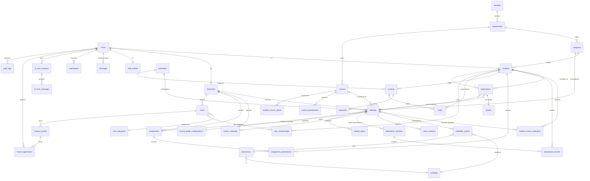

# CIS — Entity Relationship Diagram

**48 tables across 10 domains.** Renders inline on GitHub. For a click-to-edit visual version, paste [erd_dbdiagram.dbml](erd_dbdiagram.dbml) at [dbdiagram.io](https://dbdiagram.io).

## Core diagram

## Domain breakdown

### 1. Identity & Security (10 tables)
`users` is the root. Every role inherits via 1:1: `students`, `instructors`, `staff_profiles`.
Faculty scopes (`staff_faculty_scopes`, `finance_faculty_scopes`) limit which records non-admin staff can see.
Auth flows use `email_verification_tokens` + `password_reset_tokens`. All sensitive actions are tracked in `audit_logs`.

### 2. Org Structure (7 tables)
`faculties → departments → programs` is the org tree. Programs are majors students enroll into.
`semesters` defines terms; `buildings → classrooms` is the physical campus inventory; `groups` are class sections within a program.

### 3. Catalog (2 tables)
`courses` is the catalog. `course_prerequisites` is the gating graph.

### 4. Offerings & Scheduling (3 tables)
`offerings` = `(course + instructor + semester + program)` — the central join. Unique constraint on those 4 ensures no duplicate offerings.
`timetable_entries` adds the weekly room+time. `class_sessions` materializes each meeting date.

### 5. Enrollment (3 tables)
Students request via `student_course_selections` → academic staff approves → row added to `registrations` (the source of truth for "enrolled in").
`student_course_status` is a derived flat record of pass/fail per course per student.

### 6. Academic Content (6 tables)
Weekly structure: `weekly_topics`/`course_week_topics` are the topic per week. `course_materials` (files/links/videos/text) and `assignments` are tied to a week. `assignment_submissions` are student deliverables. `weekly_tasks` are non-graded weekly TODOs.

### 7. Attendance & Grades (4 tables)
`attendance_sessions` per offering, `attendance_records` per student per session.
`course_grade_configurations` holds the per-offering grading components (midterm/project/quiz/final percentages). `grades` is per registration with all component scores + computed total + pass/fail + exam-block flag.

### 8. Finance (3 tables)
`invoices` billed per (student, semester). `payments` are partial-allowed (status auto-updates `unpaid → partial → paid`). `holds` are restrictions placed by finance staff with configurable `effect` (block_registration / block_grades / block_transcript / warning).

### 9. Communications (8 tables)
`announcements` and `notifications` for one-way broadcast. `messages` for direct DM. `clubs` + `club_memberships` for student orgs (open / request / waitlist join modes). `campus_events` + `event_registrations` for events.

### 10. AI Assistant (2 tables)
`ai_chat_sessions` + `ai_chat_messages` for the student chatbot (which uses Ollama locally — see `Chatbot.tsx`).

## Naming & integrity notes
- All PK/FK columns are `INT UNSIGNED` to match `users.id`. ORM models use a custom `UnsignedInteger` SQLAlchemy variant.
- Cascade deletes are scoped: deleting a `users` row cascades to `students`/`instructors`/`staff_profiles`, but offerings/grades are preserved (instructors deletion blocked by FK to offerings).
- Status fields use string varchars (not enums) so new states can be added without migrations.
- Faculty scope filtering is enforced server-side via `_finance_faculty_ids()` / `_staff_faculty_ids()` helpers in `routes/finance.py` and `routes/staff.py`.

## Source of truth
- Live DB schema: `database/schema.sql`
- ORM models: `backend/src/models/`
- This document is regenerated from those — keep them in sync.
