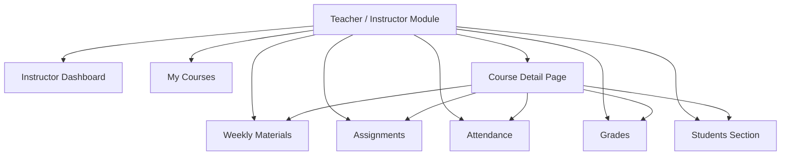

# Week 1 — Teacher Module Scope and Initial Requirements

## Overview

During the first week, the team discussed different project ideas and decided to develop a Student Information and Course Registration System. After defining the general project scope, responsibilities were divided between team members. My assigned part was the Teacher and Academic Staff Services module.

This module focuses on the academic side of the system, especially the pages and workflows used by instructors. The main goal was to identify what a teacher should be able to do inside the system and how those actions would connect with students, courses, attendance, materials, assignments, and grades.

## Main Responsibilities Identified

The first version of the Teacher module included these main sections:

- Instructor Dashboard
- My Courses
- Teacher Course Detail Page
- Weekly Materials
- Teacher Assignments
- Attendance Management
- Grades Management
- Students Section
- Academic Staff support pages

## Initial Teacher Module Scope Diagram

## Explanation of the Diagram

This diagram shows the first structure of the Teacher module. The instructor starts from the dashboard, views assigned courses, opens a selected course, and then accesses course-related sections such as materials, assignments, attendance, grades, and enrolled students.

## Outcome of Week 1

By the end of Week 1, the Teacher and Academic Staff Services module had a clear initial scope. The main teacher pages were identified, and the module was ready for more detailed use case and workflow planning.
