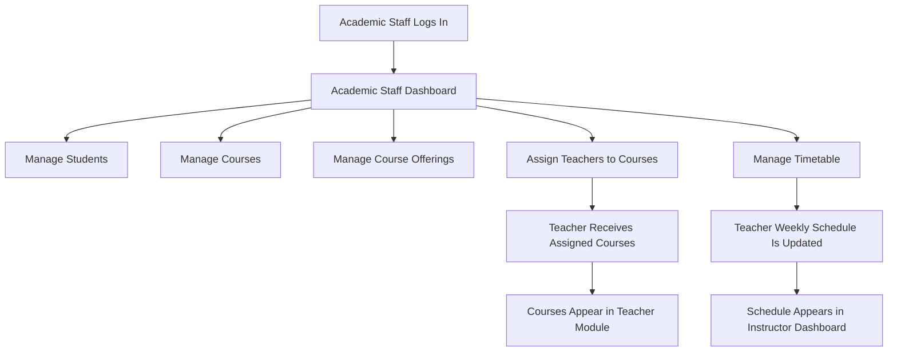

# Activity Diagram — Academic Staff Access Flow

## Purpose

This diagram shows how Academic Staff actions support the Teacher module. Academic Staff can manage courses, course offerings, teacher assignments, and timetables. These actions affect what the teacher sees later in the system.

## Mermaid Diagram

## Explanation

Academic Staff manages the academic structure of the system. When staff assigns a teacher to a course offering, that course becomes visible in the teacher’s assigned courses. When staff manages the timetable, the teacher’s weekly schedule is updated.

## Result

This diagram shows the connection between Academic Staff work and the Teacher module. It explains why the teacher can only see courses and schedules that are assigned through the academic workflow.
