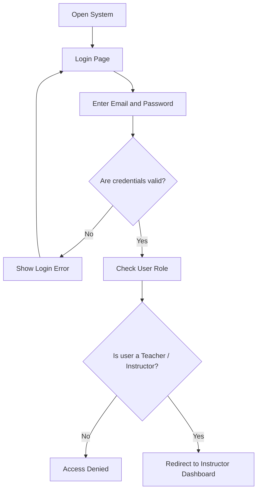

# Activity Diagram — Login

## Purpose

This activity diagram shows the login process for a teacher. It explains how the system checks user credentials and verifies whether the user has permission to access the Teacher module.

## Mermaid Diagram

## Explanation

The teacher opens the system and enters login credentials. The system validates the email and password. If the credentials are incorrect, an error message is displayed. If the credentials are correct, the system checks the user role. Only users with the teacher or instructor role are allowed to access the Instructor Dashboard.

## Result

This diagram helps document the first security step of the Teacher module: authentication and role verification.
