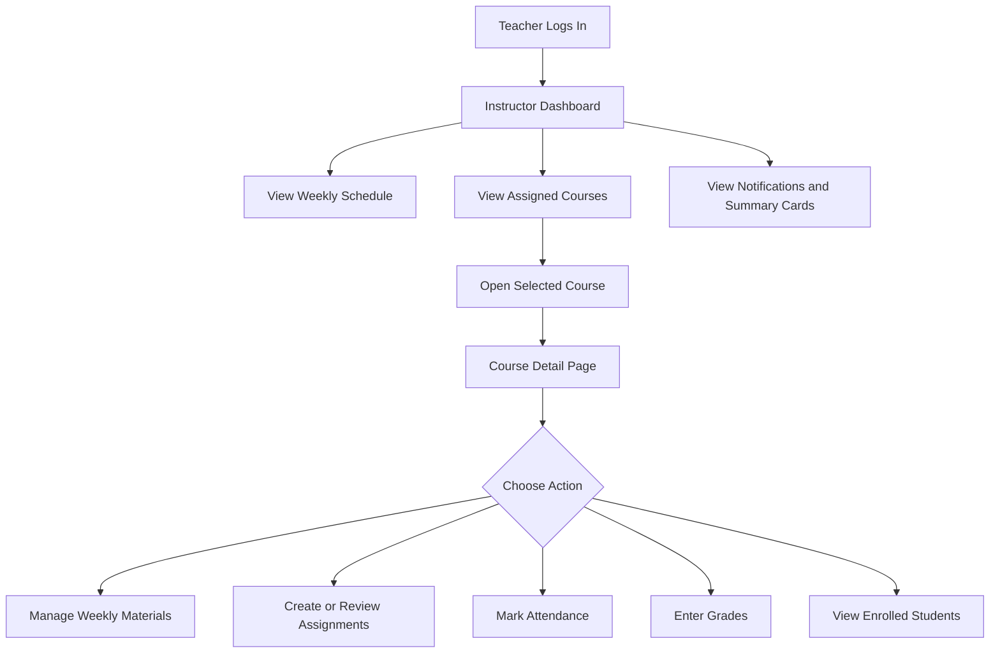

# Activity Diagram — Teacher Access Flow

## Purpose

This diagram shows how a teacher navigates through the Teacher module after logging in. It explains the main flow from the dashboard to course-related actions.

## Mermaid Diagram

## Explanation

After login, the teacher is redirected to the Instructor Dashboard. From there, the teacher can view the weekly schedule, dashboard summary, and assigned courses. When a course is selected, the teacher opens the Course Detail Page and can manage materials, assignments, attendance, grades, and students related to that course.

## Result

This diagram shows the main teacher workflow and connects the dashboard with the course management features.
