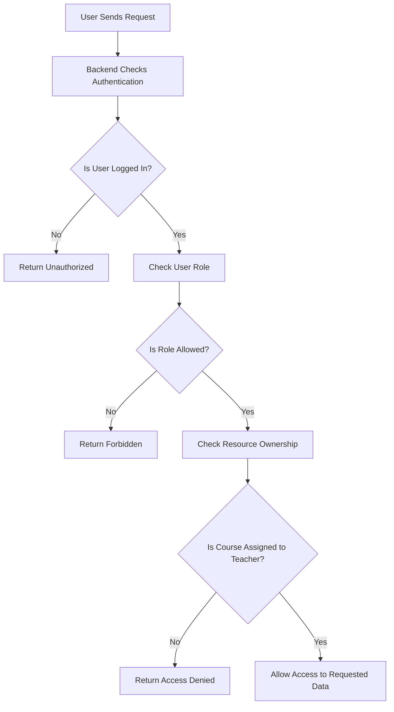

# RBAC Notes — Teacher and Academic Staff Services

## Purpose

RBAC stands for Role-Based Access Control. It is used to make sure that each user can access only the pages and data related to their role.

In the Teacher and Academic Staff Services module, RBAC is important because teachers should only access their own assigned courses, students, materials, assignments, attendance records, and grades.

## Main RBAC Rules

The main RBAC rules for the Teacher module are:

- A teacher can access only instructor pages.
- A teacher can view only assigned courses.
- A teacher can open only course offerings assigned to them.
- A teacher can upload materials only for their own courses.
- A teacher can create assignments only for their own courses.
- A teacher can mark attendance only for students enrolled in their assigned courses.
- A teacher can enter grades only for students enrolled in their assigned courses.
- A teacher cannot access another teacher’s course data.
- A teacher cannot manage academic staff administration pages unless given permission.

## RBAC Flow Diagram

## Explanation

The system first checks if the user is logged in. Then it checks the user role. If the user has the correct role, the system checks whether the requested course or resource belongs to that teacher. If the course is not assigned to the teacher, access is denied.

## Result

RBAC protects academic data and ensures that teachers only work with their own courses and students. This makes the system more secure, organized, and realistic.
