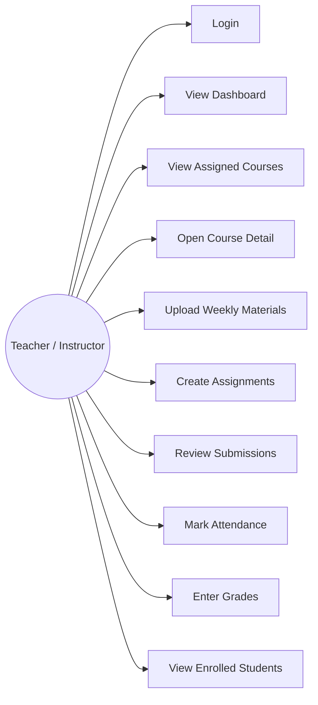
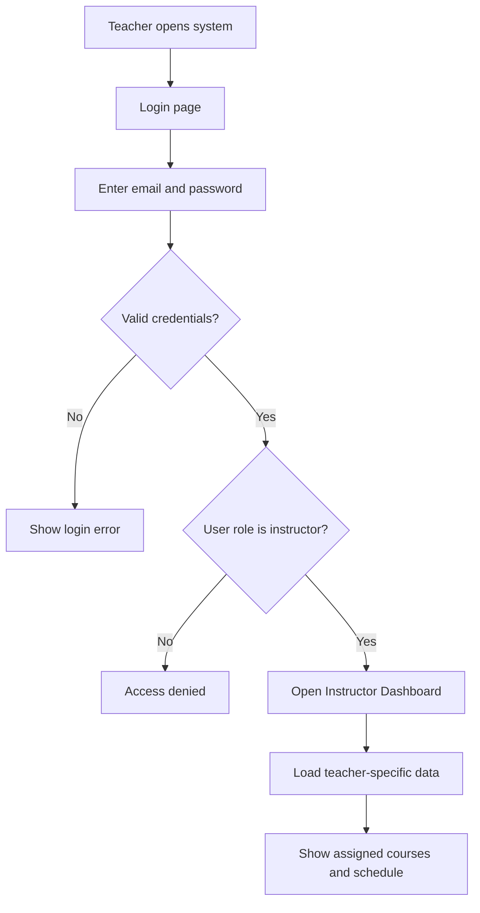

# Week 2 — Teacher Use Cases and Access Flow

## Overview

During Week 2, the focus was on organizing the teacher-related workflows and defining how instructors would interact with the system. The main objective was to connect functional requirements with real user actions.

This included planning teacher login, assigned courses, material upload, assignment creation, attendance marking, grade entry, and student viewing. Role-based access control was also discussed to make sure that teachers only access their own assigned courses and academic data.

## Main Teacher Use Cases

The main use cases for the Teacher module are:

- Log in as instructor
- View instructor dashboard
- View assigned courses
- Open course detail page
- Upload weekly materials
- Create assignments
- Review submissions
- Mark attendance
- Enter grades
- View enrolled students

## Teacher Use Case Diagram

## Teacher Access Flow Diagram

## Explanation of the Diagrams

The first diagram shows the main actions that the teacher can perform in the system. The second diagram shows the login and access flow. After login, the system checks whether the user has the instructor role. If the role is valid, the teacher is redirected to the Instructor Dashboard.
