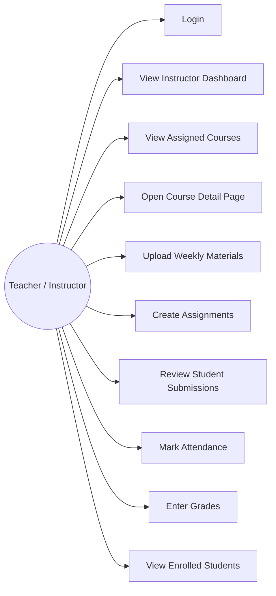

# Use Case Diagram — Teacher and Academic Staff Services

## Purpose

This diagram shows the main actions that a teacher can perform in the Teacher and Academic Staff Services module. It focuses on the teacher side of the system and presents the most important academic workflows.

## Mermaid Diagram

## Explanation

The teacher starts by logging into the system. After authentication, the teacher can access the Instructor Dashboard and view assigned courses. From a selected course, the teacher can manage weekly materials, create assignments, review submissions, mark attendance, enter grades, and view enrolled students.

This diagram helps define the main responsibilities of the teacher inside the system.
