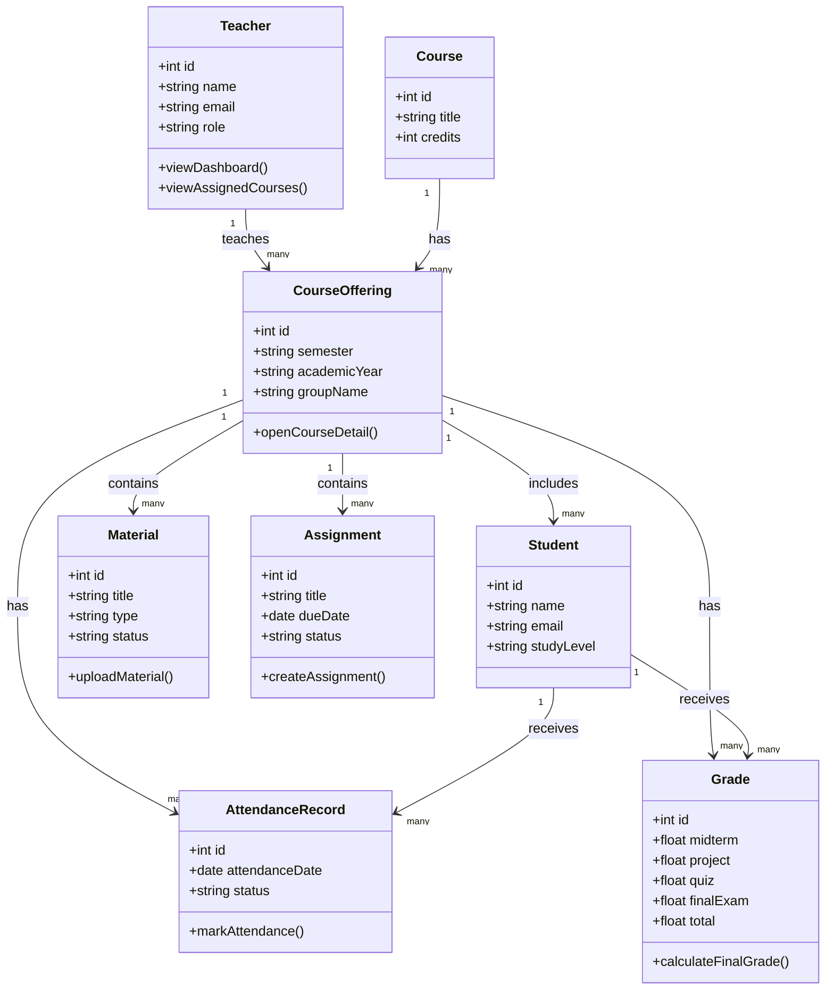

# Class Diagram — Teacher Module Main Classes

## Purpose

This class diagram shows the main data classes related to the Teacher module. It focuses on the relationships between teacher, course offering, students, materials, assignments, attendance, and grades.

## Mermaid Diagram

## Explanation

The Teacher class is connected to CourseOffering because teachers teach assigned course offerings. Each course offering belongs to a course and includes enrolled students. Materials, assignments, attendance records, and grades are all connected to the course offering.

## Result

This class diagram helps explain the main structure of the Teacher module and how the academic data is connected.
