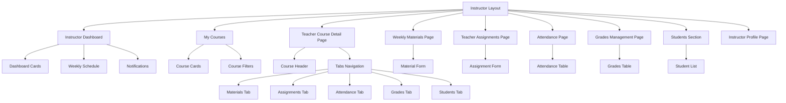

# Component Diagram — Frontend Teacher Pages

This component diagram shows the main frontend pages and reusable components of the Teacher module. It explains how the instructor area is organized in the frontend.

## Component Diagram

The Instructor Layout acts as the main wrapper for all teacher pages. The teacher can access the dashboard, assigned courses, course detail page, materials, assignments, attendance, grades, students, and profile.

The Teacher Course Detail Page is important because it connects several academic actions under one selected course. From this page, the teacher can move between materials, assignments, attendance, grades, and students using tab navigation.
