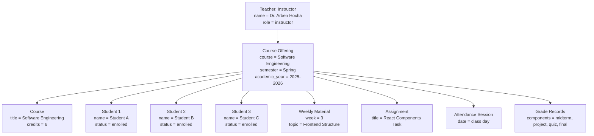

# Object Diagram — Teacher with Course Offering and Students

## Purpose

This object diagram shows an example of how a teacher is connected to a course offering and enrolled students. It represents a real situation inside the Teacher module.

## Mermaid Diagram

## Explanation

This diagram shows one teacher assigned to one course offering. The course offering connects the teacher with the course and enrolled students. The same course offering is also connected to materials, assignments, attendance sessions, and grade records.

## Result

This object diagram helps explain how the Teacher module works with real data. It shows that most teacher actions are connected through the selected course offering.
