# Package Diagram — Teacher Module Structure

## Purpose

This package diagram shows how the Teacher module can be organized into logical frontend packages. It helps explain the structure of the module from a development point of view.

## Mermaid Diagram

```mermaid
flowchart TD
    A[Teacher Module] --> B[Layout Package]
    A --> C[Pages Package]
    A --> D[Components Package]
    A --> E[Services / API Package]
    A --> F[State and Hooks Package]

    B --> B1[InstructorLayout]

    C --> C1[InstructorDashboard]
    C --> C2[MyCourses]
    C --> C3[TeacherCourseDetailPage]
    C --> C4[WeeklyMaterialsPage]
    C --> C5[TeacherAssignmentsPage]
    C --> C6[AttendancePage]
    C --> C7[GradesManagement]
    C --> C8[StudentsSection]

    D --> D1[Dashboard Cards]
    D --> D2[Course Cards]
    D --> D3[Tables]
    D --> D4[Forms]
    D --> D5[Filters]
    D --> D6[Tabs]
    D --> D7[Status Badges]

    E --> E1[Teacher API Calls]
    E --> E2[Course API Calls]
    E --> E3[Material API Calls]
    E --> E4[Assignment API Calls]
    E --> E5[Attendance API Calls]
    E --> E6[Grades API Calls]

    F --> F1[Loading States]
    F --> F2[Error States]
    F --> F3[Selected Course State]
    F --> F4[Form State]
```

## Explanation

The Teacher module is divided into several logical parts. The layout package contains the instructor layout. The pages package contains the main teacher pages. The components package contains reusable UI elements. The services or API package handles communication with the backend. The state and hooks package manages loading, errors, selected course data, and form state.

## Result

This diagram helps explain how the frontend Teacher module is structured and how each part contributes to the full instructor workflow.
