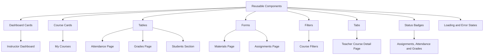

# Reusable Components Notes — Teacher Module

## Purpose

This document describes the reusable frontend components planned for the Teacher module. Reusable components help keep the user interface consistent and reduce repeated code across instructor pages.

## Main Reusable Components

The main reusable components used or planned in the Teacher module include:

- Dashboard cards
- Course cards
- Page headers
- Tables
- Forms
- Filters
- Tabs
- Status badges
- Loading states
- Empty states
- Error messages
- Action buttons

## Component Usage Diagram

## Explanation

Reusable components are shared between different pages of the Teacher module. For example, tables are used in attendance, grades, and students pages. Forms are used for materials and assignments. Tabs are used in the Teacher Course Detail Page to organize course-related actions.

## Result

Using reusable components makes the Teacher module easier to maintain, more consistent, and more organized.
