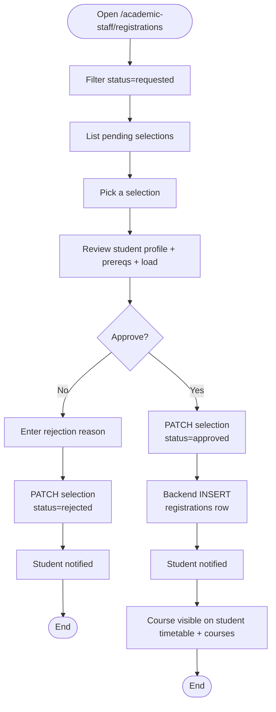
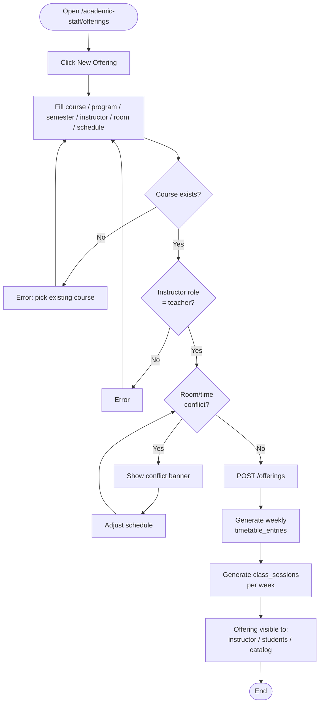
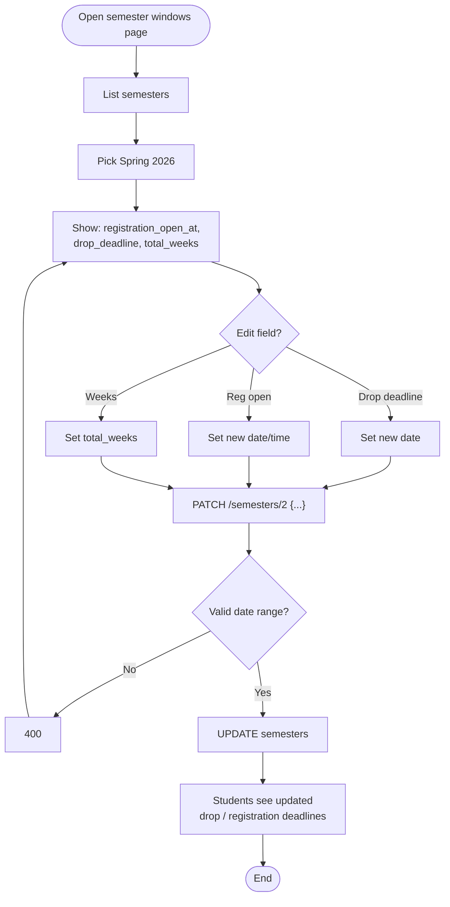
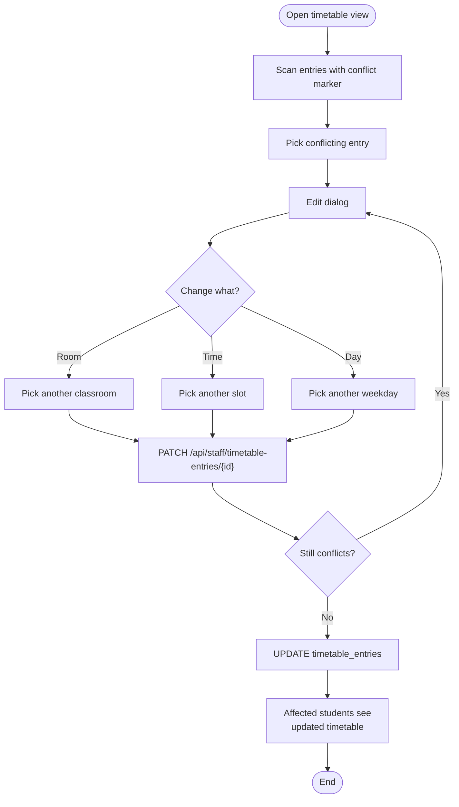

# Academic Staff — Activity Diagrams

## A1 — Course selection approval

```mermaid
flowchart TD
    Start([Open /academic-staff/registrations]) --> Filter[Filter status=requested]
    Filter --> List[List pending selections]
    List --> Pick[Pick a selection]
    Pick --> Review[Review student profile + prereqs + load]
    Review --> Decide{Approve?}
    Decide -- No --> Reason[Enter rejection reason]
    Reason --> Reject[PATCH selection<br/>status=rejected]
    Reject --> Notify1[Student notified]
    Notify1 --> End1([End])
    Decide -- Yes --> Approve[PATCH selection<br/>status=approved]
    Approve --> InsertReg[Backend INSERT<br/>registrations row]
    InsertReg --> Notify2[Student notified]
    Notify2 --> Visible[Course visible on student timetable + courses]
    Visible --> End2([End])
```

## A2 — Create offering with timetable

```mermaid
flowchart TD
    Start([Open /academic-staff/offerings]) --> NewBtn[Click New Offering]
    NewBtn --> Form[Fill course / program / semester / instructor / room / schedule]
    Form --> CheckCourse{Course exists?}
    CheckCourse -- No --> ErrC[Error: pick existing course]
    ErrC --> Form
    CheckCourse -- Yes --> CheckTeacher{Instructor role<br/>= teacher?}
    CheckTeacher -- No --> ErrT[Error]
    ErrT --> Form
    CheckTeacher -- Yes --> CheckConflict{Room/time<br/>conflict?}
    CheckConflict -- Yes --> ConflictBanner[Show conflict banner]
    ConflictBanner --> EditTime[Adjust schedule]
    EditTime --> CheckConflict
    CheckConflict -- No --> Submit[POST /offerings]
    Submit --> AutoTT[Generate weekly<br/>timetable_entries]
    AutoTT --> Sessions[Generate class_sessions<br/>per week]
    Sessions --> Visible[Offering visible to:<br/>instructor / students / catalog]
    Visible --> End([End])
```

## A3 — Adjust semester windows

```mermaid
flowchart TD
    Start([Open semester windows page]) --> List[List semesters]
    List --> Pick[Pick Spring 2026]
    Pick --> Fields[Show: registration_open_at,<br/>drop_deadline, total_weeks]
    Fields --> Edit{Edit field?}
    Edit -- Drop deadline --> EditDrop[Set new date]
    Edit -- Reg open --> EditReg[Set new date/time]
    Edit -- Weeks --> EditWk[Set total_weeks]
    EditDrop --> Save
    EditReg --> Save
    EditWk --> Save
    Save["PATCH /semesters/2 {...}"] --> Validate{Valid date range?}
    Validate -- No --> Err[400]
    Err --> Fields
    Validate -- Yes --> Update[UPDATE semesters]
    Update --> Effect[Students see updated<br/>drop / registration deadlines]
    Effect --> End([End])
```

## A4 — Resolve timetable conflict

```mermaid
flowchart TD
    Start([Open timetable view]) --> Scan[Scan entries with conflict marker]
    Scan --> Pick[Pick conflicting entry]
    Pick --> Detail[Edit dialog]
    Detail --> Option{Change what?}
    Option -- Room --> ChangeRoom[Pick another classroom]
    Option -- Time --> ChangeTime[Pick another slot]
    Option -- Day --> ChangeDay[Pick another weekday]
    ChangeRoom --> Save
    ChangeTime --> Save
    ChangeDay --> Save
    Save["PATCH /api/staff/timetable-entries/{id}"] --> Validate{Still conflicts?}
    Validate -- Yes --> Detail
    Validate -- No --> Persist[UPDATE timetable_entries]
    Persist --> Students[Affected students see<br/>updated timetable]
    Students --> End([End])
```
