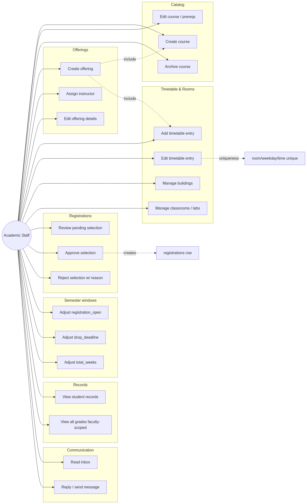
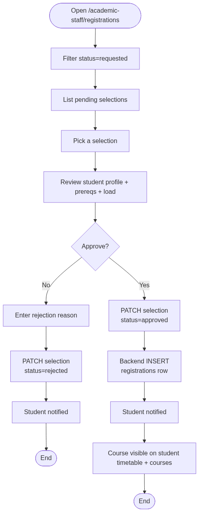
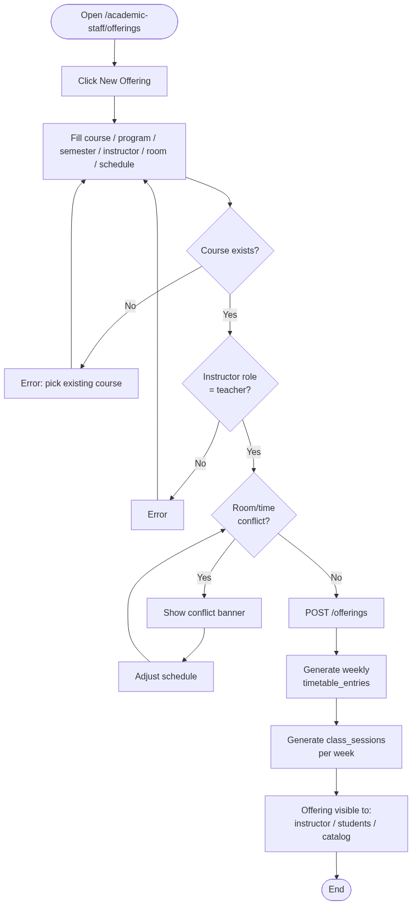
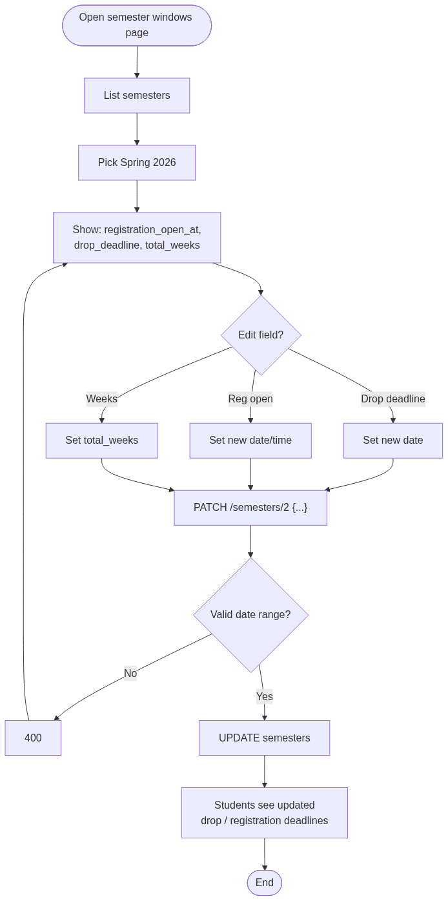
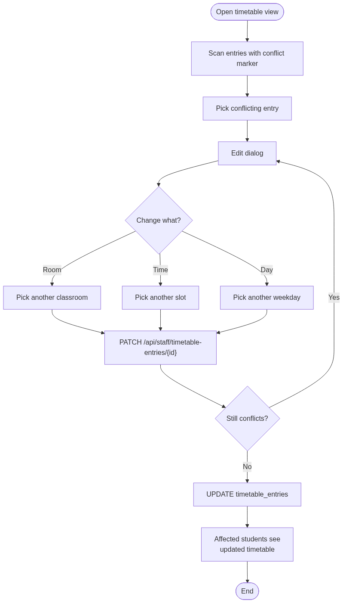
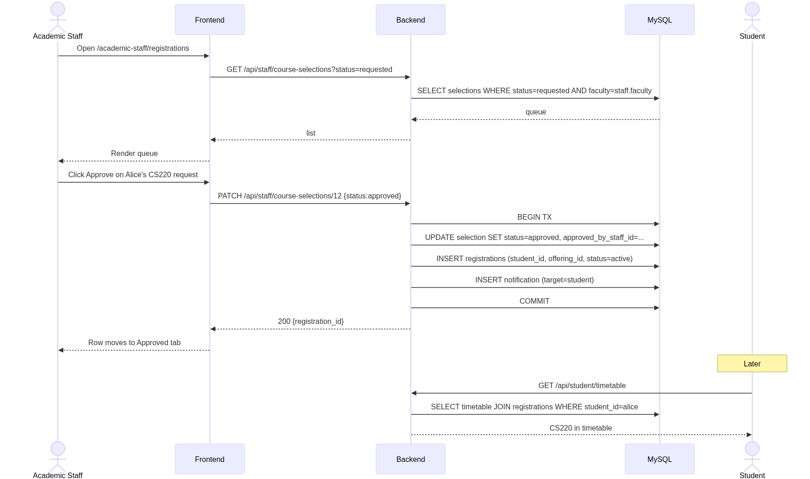
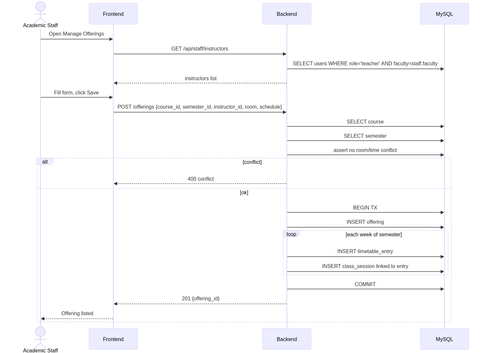
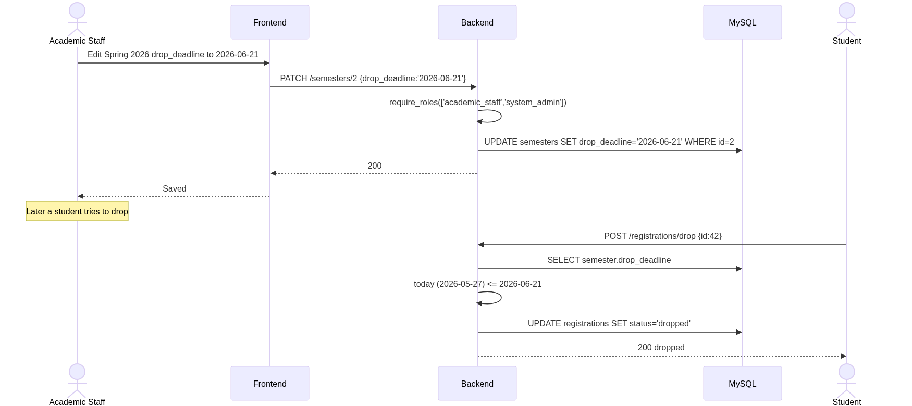
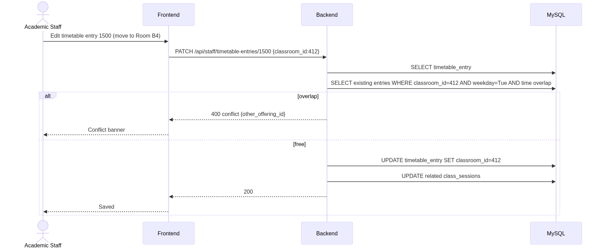

# Academic Staff — Rendered Diagrams

Auto-generated PNG renderings of every Mermaid diagram in this role's documentation. Source markdown links above each image.

## Use Cases

Source: [use-cases.md](../use-cases.md)

### Use Case Diagram

## Activity Diagrams

Source: [activity-diagrams.md](../activity-diagrams.md)

### A1 — Course selection approval

### A2 — Create offering with timetable

### A3 — Adjust semester windows

### A4 — Resolve timetable conflict

## Sequence Diagrams

Source: [sequence-diagrams.md](../sequence-diagrams.md)

### S1 — Approve student course selection

### S2 — Create offering

### S3 — Adjust drop deadline

### S4 — Timetable edit with conflict check

