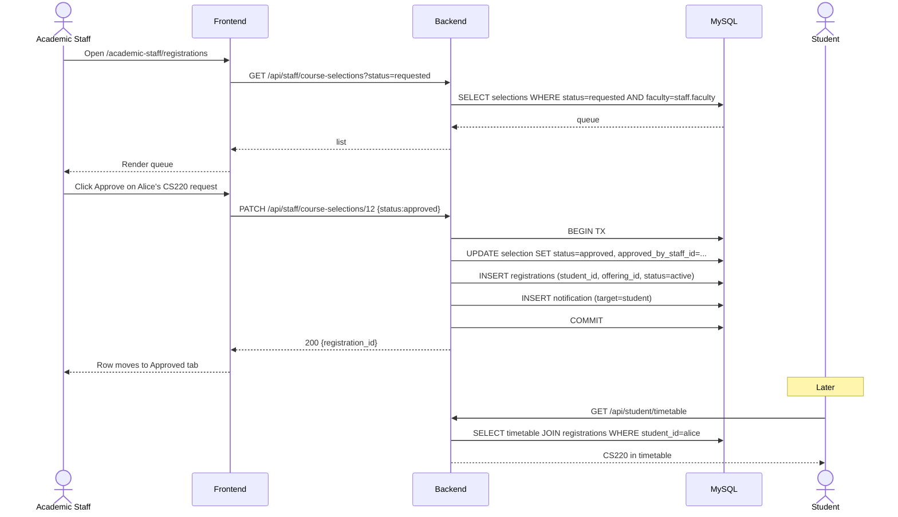
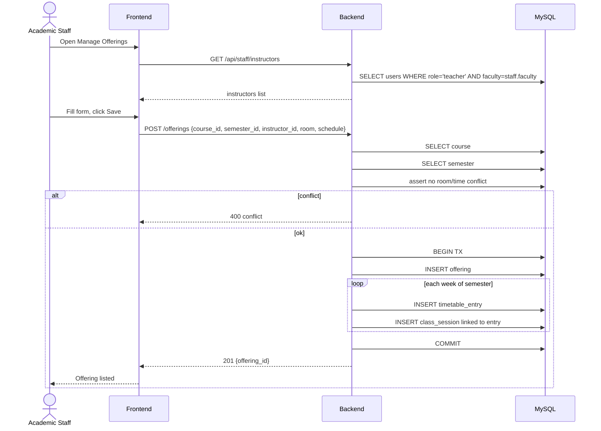
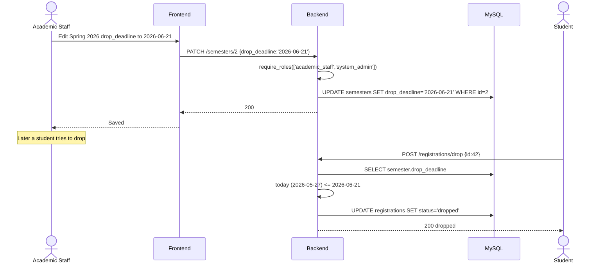
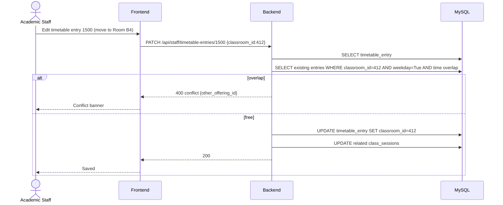

# Academic Staff — Sequence Diagrams

## S1 — Approve student course selection

```mermaid
sequenceDiagram
    actor Staff as Academic Staff
    participant FE as Frontend
    participant API as Backend
    participant DB as MySQL
    actor S as Student

    Staff->>FE: Open /academic-staff/registrations
    FE->>API: GET /api/staff/course-selections?status=requested
    API->>DB: SELECT selections WHERE status=requested AND faculty=staff.faculty
    DB-->>API: queue
    API-->>FE: list
    FE-->>Staff: Render queue

    Staff->>FE: Click Approve on Alice's CS220 request
    FE->>API: PATCH /api/staff/course-selections/12 {status:approved}
    API->>DB: BEGIN TX
    API->>DB: UPDATE selection SET status=approved, approved_by_staff_id=...
    API->>DB: INSERT registrations (student_id, offering_id, status=active)
    API->>DB: INSERT notification (target=student)
    API->>DB: COMMIT
    API-->>FE: 200 {registration_id}
    FE-->>Staff: Row moves to Approved tab

    Note over S: Later
    S->>API: GET /api/student/timetable
    API->>DB: SELECT timetable JOIN registrations WHERE student_id=alice
    API-->>S: CS220 in timetable
```

## S2 — Create offering

```mermaid
sequenceDiagram
    actor Staff as Academic Staff
    participant FE as Frontend
    participant API as Backend
    participant DB as MySQL

    Staff->>FE: Open Manage Offerings
    FE->>API: GET /api/staff/instructors
    API->>DB: SELECT users WHERE role='teacher' AND faculty=staff.faculty
    API-->>FE: instructors list

    Staff->>FE: Fill form, click Save
    FE->>API: POST /offerings {course_id, semester_id, instructor_id, room, schedule}
    API->>DB: SELECT course
    API->>DB: SELECT semester
    API->>DB: assert no room/time conflict
    alt conflict
        API-->>FE: 400 conflict
    else ok
        API->>DB: BEGIN TX
        API->>DB: INSERT offering
        loop each week of semester
            API->>DB: INSERT timetable_entry
            API->>DB: INSERT class_session linked to entry
        end
        API->>DB: COMMIT
        API-->>FE: 201 {offering_id}
        FE-->>Staff: Offering listed
    end
```

## S3 — Adjust drop deadline

```mermaid
sequenceDiagram
    actor Staff as Academic Staff
    participant FE as Frontend
    participant API as Backend
    participant DB as MySQL

    Staff->>FE: Edit Spring 2026 drop_deadline to 2026-06-21
    FE->>API: PATCH /semesters/2 {drop_deadline:'2026-06-21'}
    API->>API: require_roles(['academic_staff','system_admin'])
    API->>DB: UPDATE semesters SET drop_deadline='2026-06-21' WHERE id=2
    API-->>FE: 200
    FE-->>Staff: Saved

    Note over Staff: Later a student tries to drop
    actor S as Student
    S->>API: POST /registrations/drop {id:42}
    API->>DB: SELECT semester.drop_deadline
    API->>API: today (2026-05-27) <= 2026-06-21
    API->>DB: UPDATE registrations SET status='dropped'
    API-->>S: 200 dropped
```

## S4 — Timetable edit with conflict check

```mermaid
sequenceDiagram
    actor Staff as Academic Staff
    participant FE as Frontend
    participant API as Backend
    participant DB as MySQL

    Staff->>FE: Edit timetable entry 1500 (move to Room B4)
    FE->>API: PATCH /api/staff/timetable-entries/1500 {classroom_id:412}
    API->>DB: SELECT timetable_entry
    API->>DB: SELECT existing entries WHERE classroom_id=412 AND weekday=Tue AND time overlap
    alt overlap
        API-->>FE: 400 conflict {other_offering_id}
        FE-->>Staff: Conflict banner
    else free
        API->>DB: UPDATE timetable_entry SET classroom_id=412
        API->>DB: UPDATE related class_sessions
        API-->>FE: 200
        FE-->>Staff: Saved
    end
```
