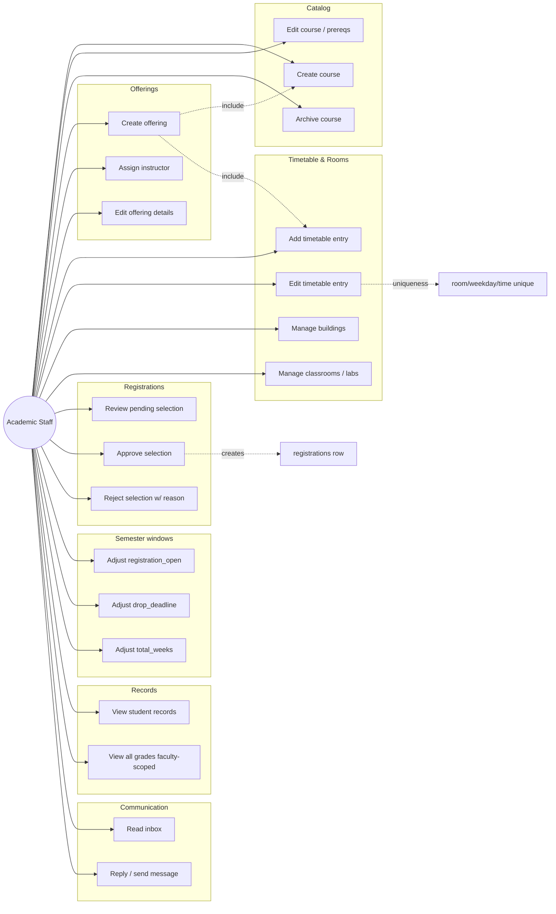

# Academic Staff — Use Cases

## Use Case Diagram

## Use Case Descriptions

### UC1 — Create course
**Main flow:** `POST /courses { code, title, credits, department_id, prerequisites }`.

### UC4 — Create offering
**Preconditions:** Course exists, semester exists, instructor has teacher role.
**Main flow:** `POST /offerings { course_id, semester_id, program_id, instructor_id, group_name, capacity, schedule, room }`.
**Side effect:** Per-week timetable entries are generated.

### UC7 — Add timetable entry
**Preconditions:** No `(classroom_id, weekday, start_time-end_time)` conflict.
**Main flow:** `POST /api/staff/timetable-entries { offering_id, weekday, start_time, end_time, classroom_id }`.

### UC11 — Review pending selection
**Main flow:** `GET /api/staff/course-selections?status=requested` returns the queue.

### UC12 — Approve selection
**Main flow:** `PATCH /api/staff/course-selections/{id} { status: 'approved' }`.
**Side effect:** Backend creates a `registrations` row.

### UC13 — Reject selection
**Main flow:** `PATCH .../{id} { status: 'rejected', reason: '...' }`.

### UC14 / UC15 / UC16 — Adjust semester windows
**Main flow:** `PATCH /semesters/{id} { registration_open_at, drop_deadline, total_weeks }`.

### UC18 — View all grades (faculty-scoped)
**Main flow:** `GET /grades/all` filters by staff's faculty scope.

### UC19 — Read inbox
**Main flow:** Same as Student / Instructor — `GET /messages/inbox`.

### UC20 — Send / reply
**Main flow:** `POST /messages` (any recipient role; contacts dropdown includes everyone except self).
