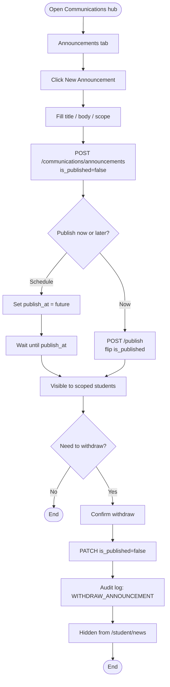
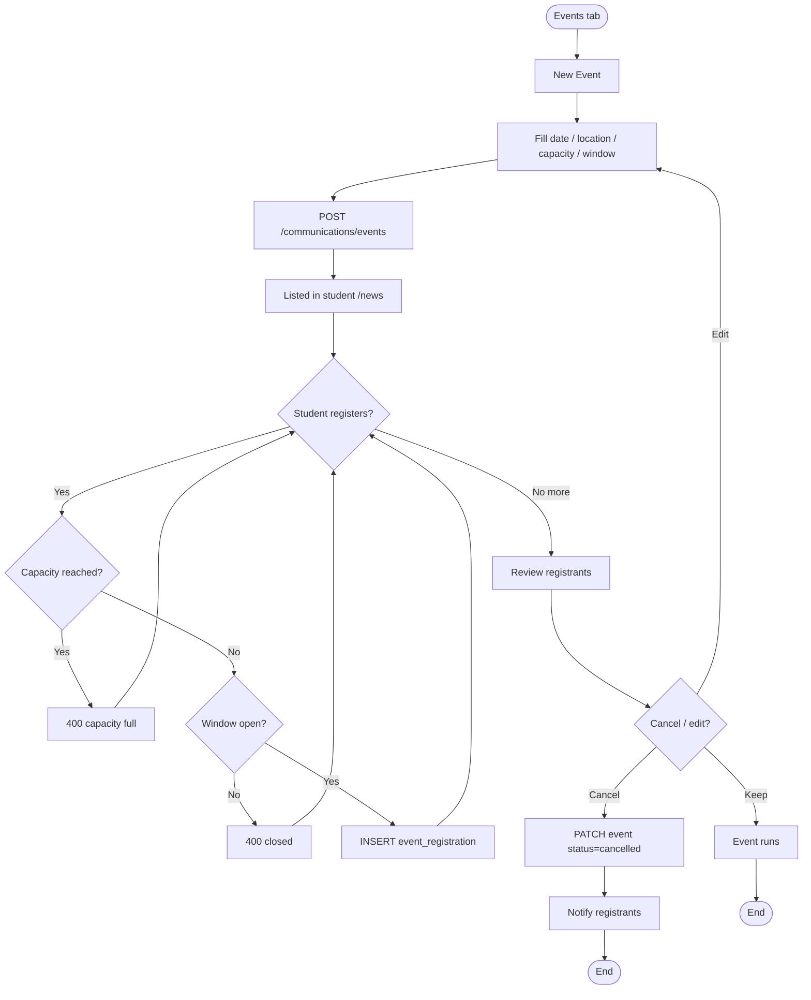
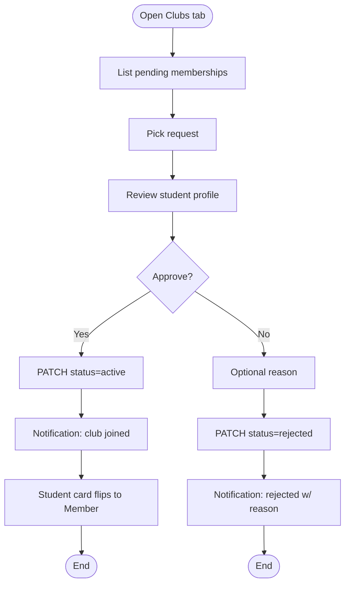
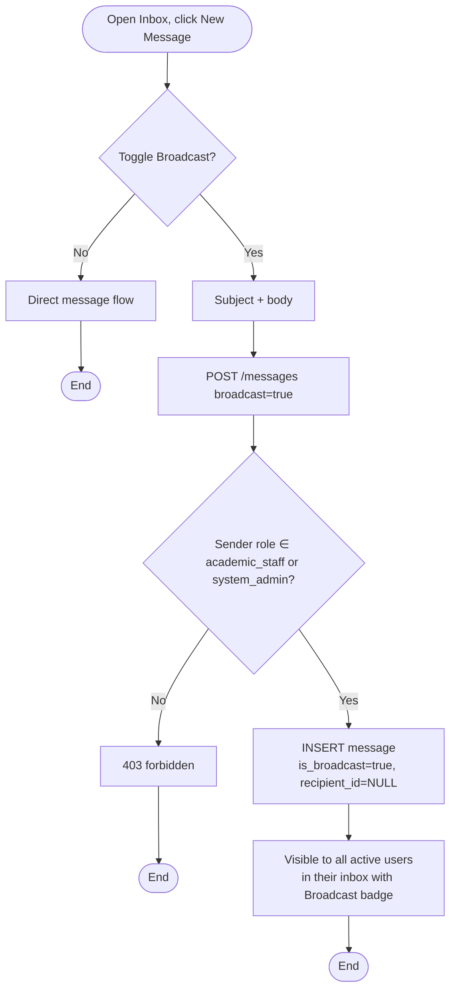

# Communications Staff — Activity Diagrams

## A1 — Announcement lifecycle (draft → publish → withdraw)

## A2 — Event creation and registration management

## A3 — Club join approval

## A4 — Broadcast message

