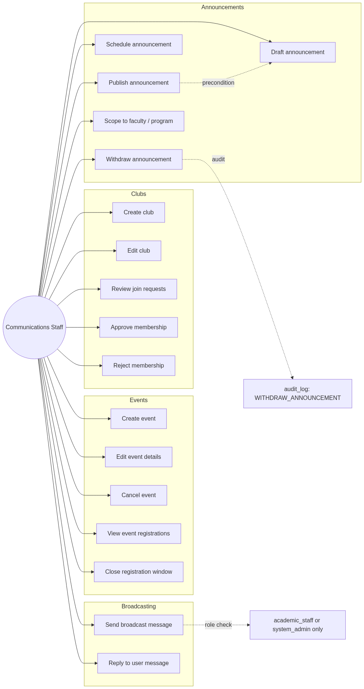
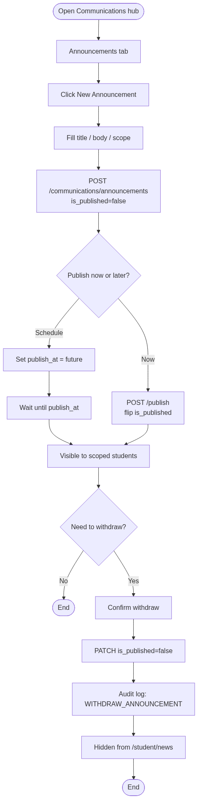
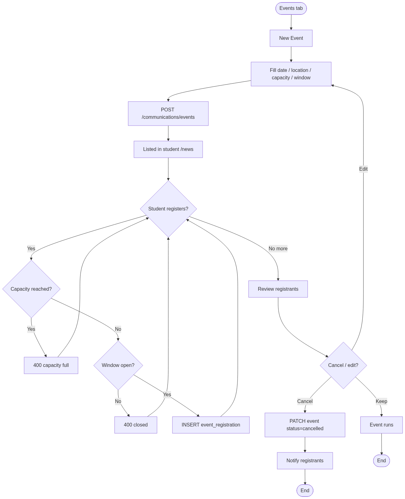
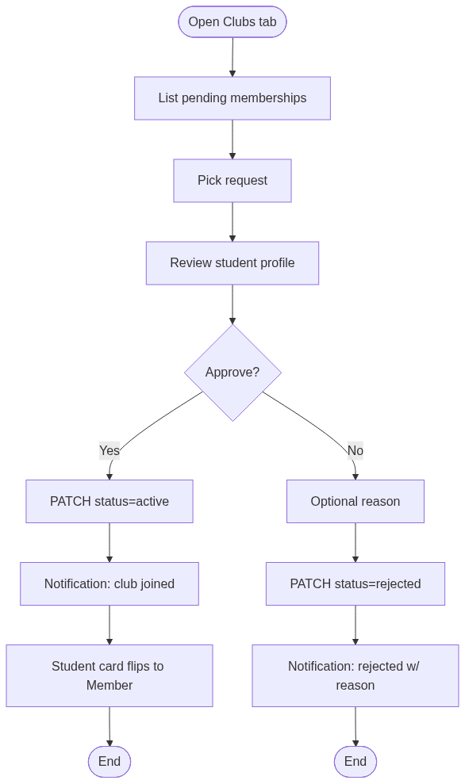
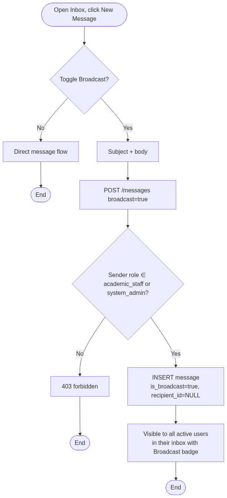
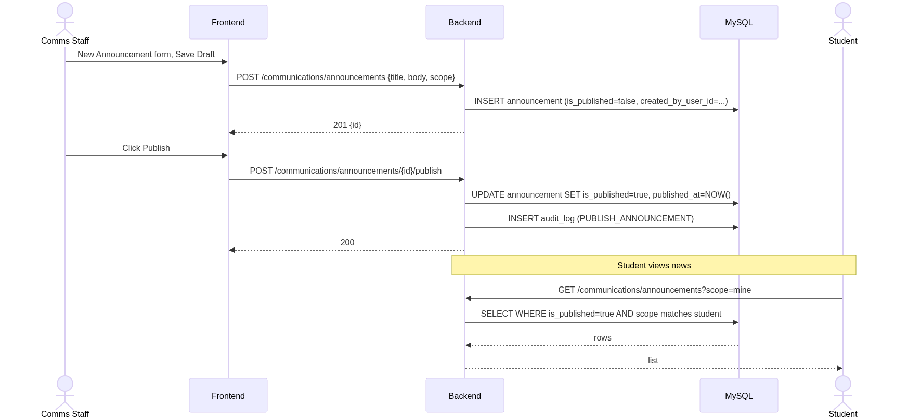
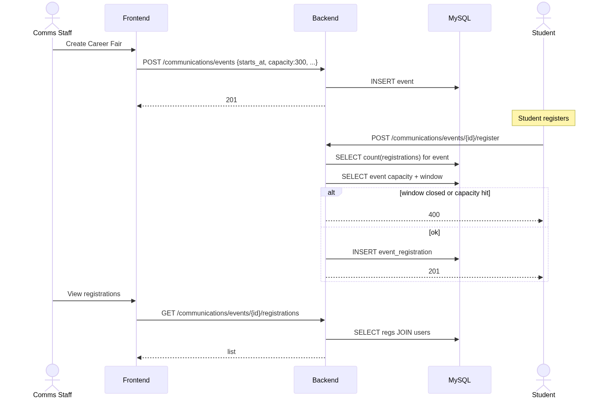
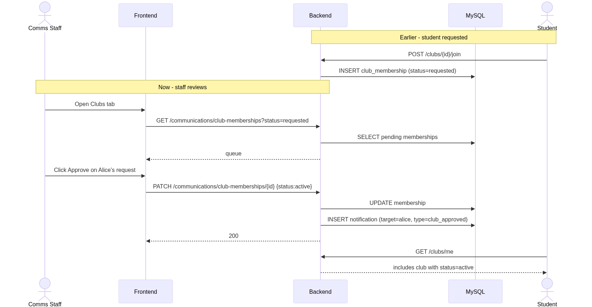
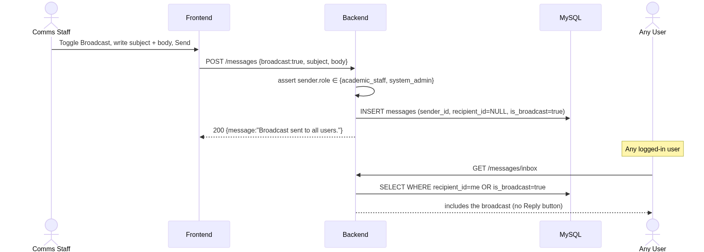

# Communications Staff — Rendered Diagrams

Auto-generated PNG renderings of every Mermaid diagram in this role's documentation. Source markdown links above each image.

## Use Cases

Source: [use-cases.md](../use-cases.md)

### Use Case Diagram

## Activity Diagrams

Source: [activity-diagrams.md](../activity-diagrams.md)

### A1 — Announcement lifecycle (draft → publish → withdraw)

### A2 — Event creation and registration management

### A3 — Club join approval

### A4 — Broadcast message

## Sequence Diagrams

Source: [sequence-diagrams.md](../sequence-diagrams.md)

### S1 — Publish announcement

### S2 — Create + register event

### S3 — Approve club membership

### S4 — Broadcast message

