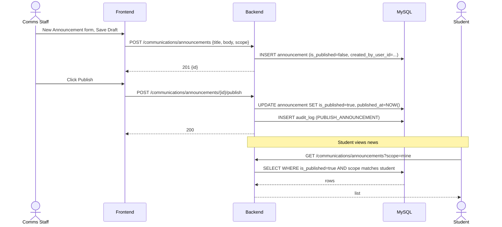
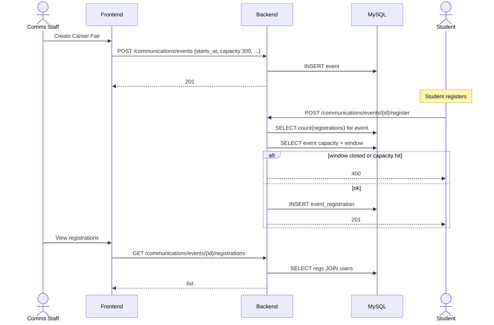
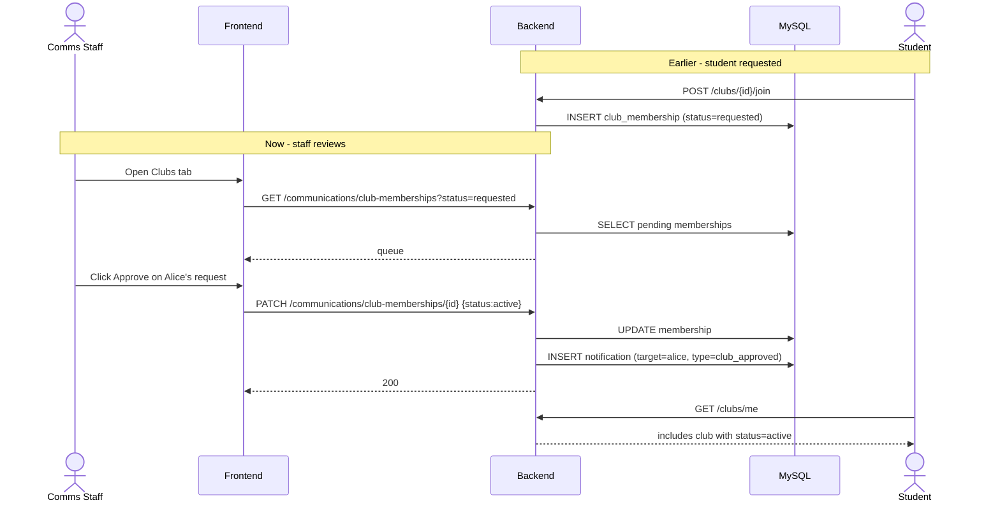
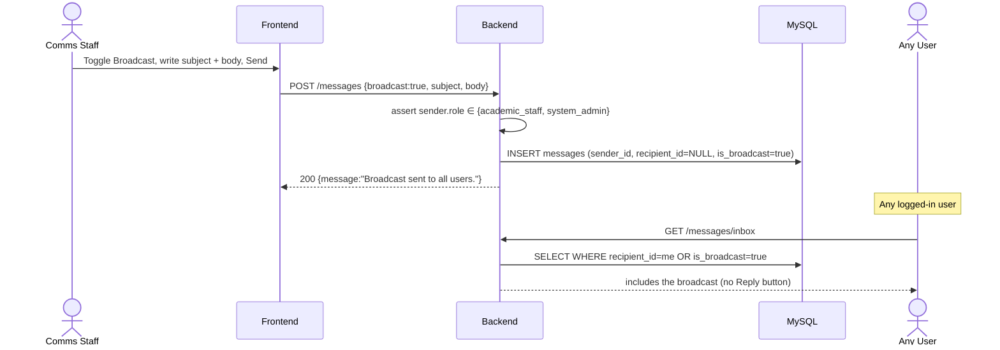

# Communications Staff — Sequence Diagrams

## S1 — Publish announcement

```mermaid
sequenceDiagram
    actor C as Comms Staff
    participant FE as Frontend
    participant API as Backend
    participant DB as MySQL
    actor S as Student

    C->>FE: New Announcement form, Save Draft
    FE->>API: POST /communications/announcements {title, body, scope}
    API->>DB: INSERT announcement (is_published=false, created_by_user_id=...)
    API-->>FE: 201 {id}

    C->>FE: Click Publish
    FE->>API: POST /communications/announcements/{id}/publish
    API->>DB: UPDATE announcement SET is_published=true, published_at=NOW()
    API->>DB: INSERT audit_log (PUBLISH_ANNOUNCEMENT)
    API-->>FE: 200

    Note over S,API: Student views news
    S->>API: GET /communications/announcements?scope=mine
    API->>DB: SELECT WHERE is_published=true AND scope matches student
    DB-->>API: rows
    API-->>S: list
```

## S2 — Create + register event

```mermaid
sequenceDiagram
    actor C as Comms Staff
    participant FE as Frontend
    participant API as Backend
    participant DB as MySQL
    actor S as Student

    C->>FE: Create Career Fair
    FE->>API: POST /communications/events {starts_at, capacity:300, ...}
    API->>DB: INSERT event
    API-->>FE: 201

    Note over S: Student registers
    S->>API: POST /communications/events/{id}/register
    API->>DB: SELECT count(registrations) for event
    API->>DB: SELECT event capacity + window
    alt window closed or capacity hit
        API-->>S: 400
    else ok
        API->>DB: INSERT event_registration
        API-->>S: 201
    end

    C->>FE: View registrations
    FE->>API: GET /communications/events/{id}/registrations
    API->>DB: SELECT regs JOIN users
    API-->>FE: list
```

## S3 — Approve club membership

```mermaid
sequenceDiagram
    actor C as Comms Staff
    participant FE as Frontend
    participant API as Backend
    participant DB as MySQL
    actor S as Student

    Note over S,API: Earlier - student requested
    S->>API: POST /clubs/{id}/join
    API->>DB: INSERT club_membership (status=requested)

    Note over C,API: Now - staff reviews
    C->>FE: Open Clubs tab
    FE->>API: GET /communications/club-memberships?status=requested
    API->>DB: SELECT pending memberships
    API-->>FE: queue

    C->>FE: Click Approve on Alice's request
    FE->>API: PATCH /communications/club-memberships/{id} {status:active}
    API->>DB: UPDATE membership
    API->>DB: INSERT notification (target=alice, type=club_approved)
    API-->>FE: 200

    S->>API: GET /clubs/me
    API-->>S: includes club with status=active
```

## S4 — Broadcast message

```mermaid
sequenceDiagram
    actor C as Comms Staff
    participant FE as Frontend
    participant API as Backend
    participant DB as MySQL
    actor U as Any User

    C->>FE: Toggle Broadcast, write subject + body, Send
    FE->>API: POST /messages {broadcast:true, subject, body}
    API->>API: assert sender.role ∈ {academic_staff, system_admin}
    API->>DB: INSERT messages (sender_id, recipient_id=NULL, is_broadcast=true)
    API-->>FE: 200 {message:"Broadcast sent to all users."}

    Note over U: Any logged-in user
    U->>API: GET /messages/inbox
    API->>DB: SELECT WHERE recipient_id=me OR is_broadcast=true
    API-->>U: includes the broadcast (no Reply button)
```
