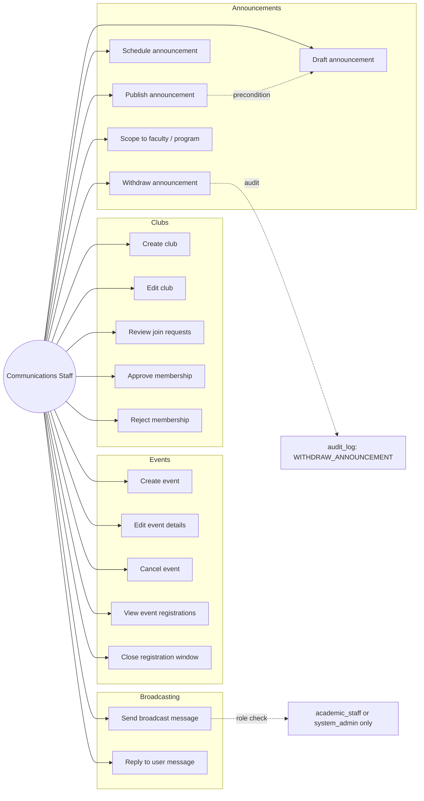

# Communications Staff — Use Cases

## Use Case Diagram

## Use Case Descriptions

### UC1 — Draft announcement
**Main flow:** `POST /communications/announcements { title, body, scope, publish_at }`; `is_published = false`.

### UC2 — Publish announcement
**Main flow:** `POST /communications/announcements/{id}/publish` → flips `is_published`, sets `published_at`.

### UC3 — Schedule announcement
**Main flow:** Same as UC1 with future `publish_at`. A background job (or on-demand fetch logic) treats it as visible only when `publish_at <= now`.

### UC4 — Withdraw announcement
**Main flow:** `PATCH /communications/announcements/{id} { is_published: false }`. Audit log entry recorded.

### UC5 — Scope to faculty / program
**Main flow:** Announcement carries `scope` field; backend fetch filters by viewer.

### UC6 — Create event
**Main flow:** `POST /communications/events { title, starts_at, ends_at, location, capacity, registration_close_at }`.

### UC9 — View event registrations
**Main flow:** `GET /communications/events/{id}/registrations`.

### UC11 — Create club
**Main flow:** `POST /communications/clubs { name, description, category_id }`.

### UC13 — Review join requests
**Main flow:** `GET /communications/club-memberships?status=requested`.

### UC14 / UC15 — Approve / reject
**Main flow:** `PATCH /communications/club-memberships/{id} { status: 'active'|'rejected', reason? }`.

### UC16 — Broadcast message
**Preconditions:** Sender role ∈ {academic_staff, system_admin}.
**Main flow:** `POST /messages { broadcast: true, subject, body }`. Server enforces role.

### UC17 — Reply to user message
**Main flow:** Same as inbox reply (UC15 in Instructor docs).
