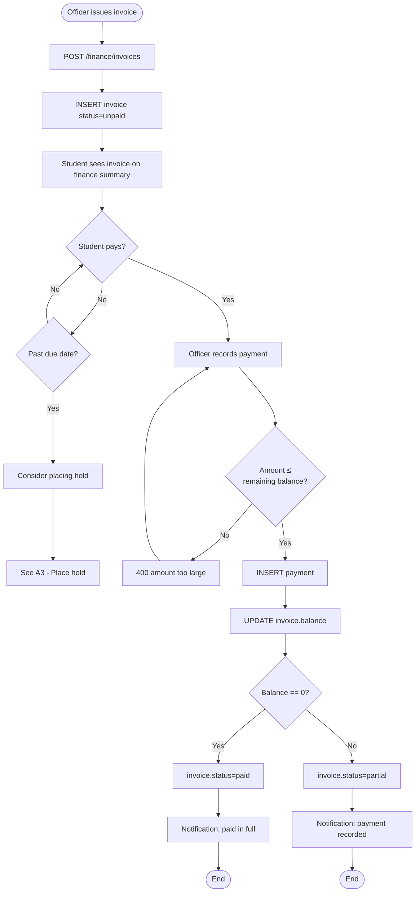
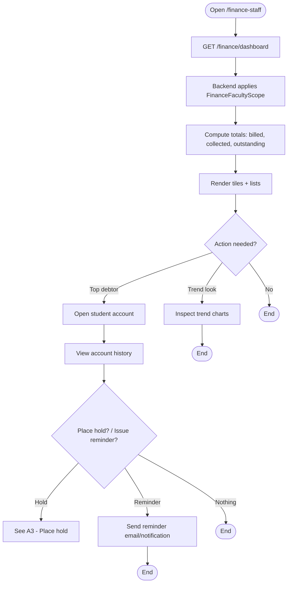
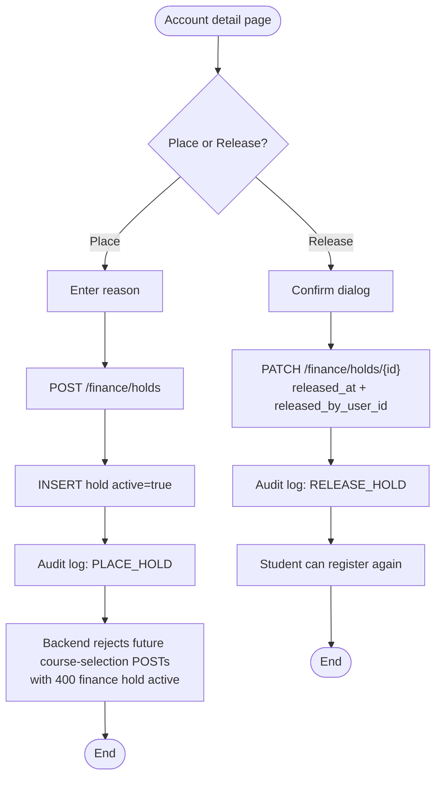
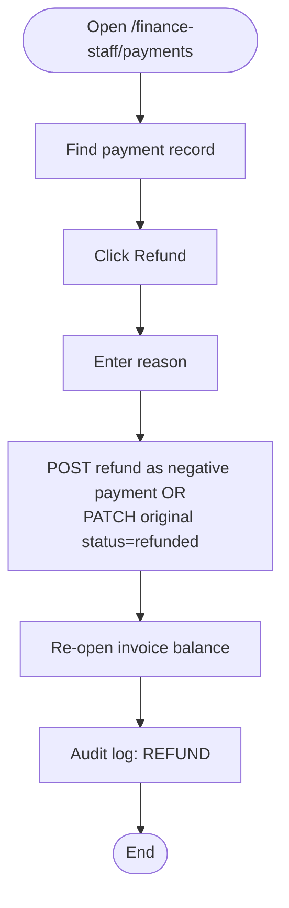

# Finance Staff — Activity Diagrams

## A1 — Invoice → payment → balance update

```mermaid
flowchart TD
    Start([Officer issues invoice]) --> CreateInv[POST /finance/invoices]
    CreateInv --> StoreI[INSERT invoice status=unpaid]
    StoreI --> Visible[Student sees invoice on finance summary]
    Visible --> Wait{Student pays?}
    Wait -- No --> Overdue{Past due date?}
    Overdue -- No --> Wait
    Overdue -- Yes --> Consider[Consider placing hold]
    Consider --> ContinueA[See A3 - Place hold]
    Wait -- Yes --> RecordP[Officer records payment]
    RecordP --> Validate{Amount ≤<br/>remaining balance?}
    Validate -- No --> Err[400 amount too large]
    Err --> RecordP
    Validate -- Yes --> StoreP[INSERT payment]
    StoreP --> Update[UPDATE invoice.balance]
    Update --> Check{Balance == 0?}
    Check -- Yes --> Mark[invoice.status=paid]
    Check -- No --> Partial[invoice.status=partial]
    Mark --> Notify[Notification: paid in full]
    Partial --> Notify2[Notification: payment recorded]
    Notify --> End1([End])
    Notify2 --> End2([End])
```

## A2 — Faculty dashboard review

```mermaid
flowchart TD
    Start([Open /finance-staff]) --> Fetch[GET /finance/dashboard]
    Fetch --> Scope[Backend applies FinanceFacultyScope]
    Scope --> Compute[Compute totals: billed, collected, outstanding]
    Compute --> Render[Render tiles + lists]
    Render --> Decide{Action needed?}
    Decide -- Top debtor --> DrillD[Open student account]
    Decide -- Trend look --> Charts[Inspect trend charts]
    Decide -- No --> End1([End])
    DrillD --> Detail[View account history]
    Detail --> Action{Place hold? / Issue reminder?}
    Action -- Hold --> A3[See A3 - Place hold]
    Action -- Reminder --> Email[Send reminder email/notification]
    Action -- Nothing --> End2([End])
    Email --> End3([End])
    Charts --> End4([End])
```

## A3 — Place / release hold

```mermaid
flowchart TD
    Start([Account detail page]) --> Decide{Place or Release?}
    Decide -- Place --> PR[Enter reason]
    PR --> Post[POST /finance/holds]
    Post --> Store[INSERT hold active=true]
    Store --> Audit1[Audit log: PLACE_HOLD]
    Audit1 --> Effect1[Backend rejects future course-selection POSTs<br/>with 400 finance hold active]
    Effect1 --> End1([End])
    Decide -- Release --> Confirm[Confirm dialog]
    Confirm --> Patch["PATCH /finance/holds/{id}<br/>released_at + released_by_user_id"]
    Patch --> Audit2[Audit log: RELEASE_HOLD]
    Audit2 --> Effect2[Student can register again]
    Effect2 --> End2([End])
```

## A4 — Recording a refund (rare)

```mermaid
flowchart TD
    Start([Open /finance-staff/payments]) --> Find[Find payment record]
    Find --> Refund[Click Refund]
    Refund --> Reason[Enter reason]
    Reason --> Post[POST refund as negative payment OR<br/>PATCH original status=refunded]
    Post --> AdjustInv[Re-open invoice balance]
    AdjustInv --> Audit[Audit log: REFUND]
    Audit --> End([End])
```
