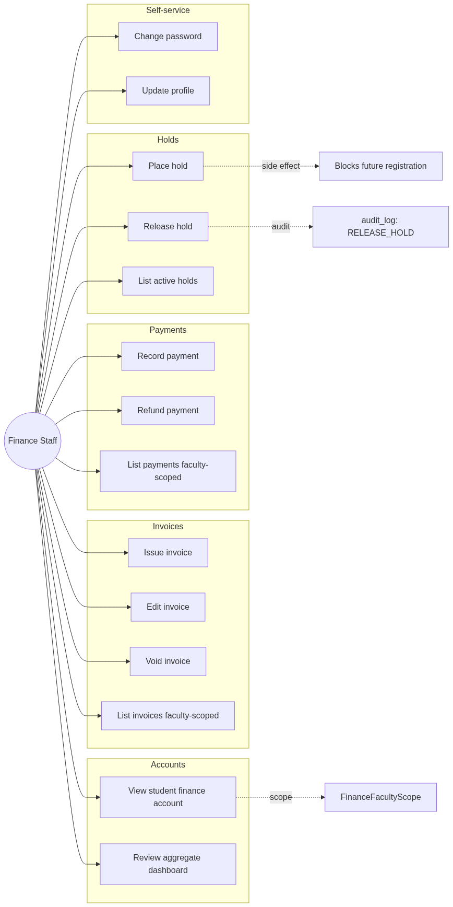
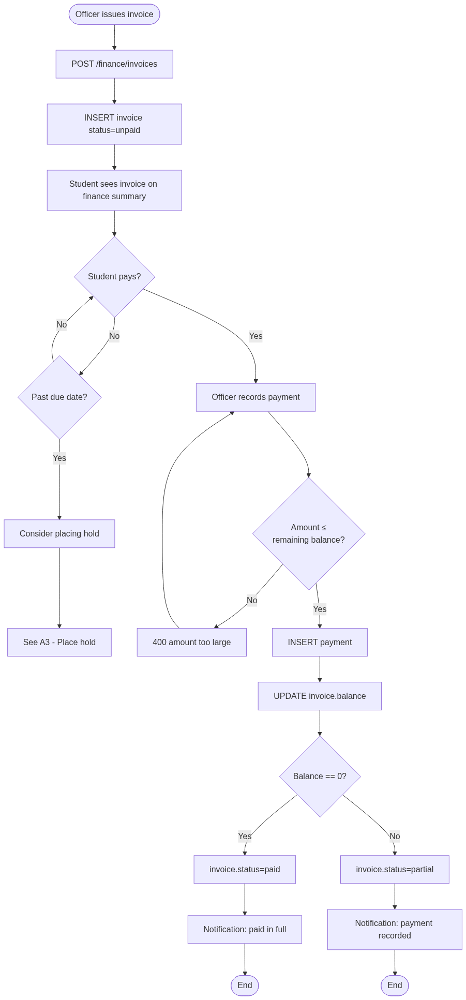
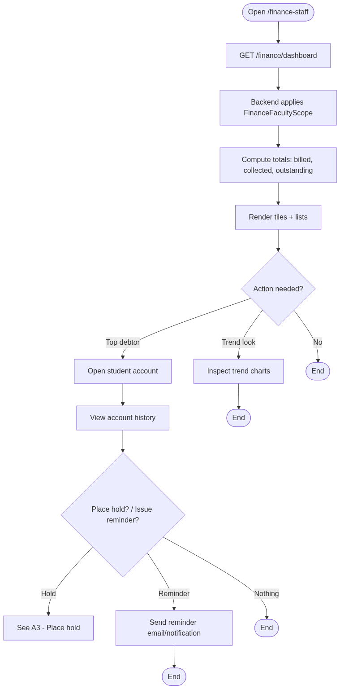
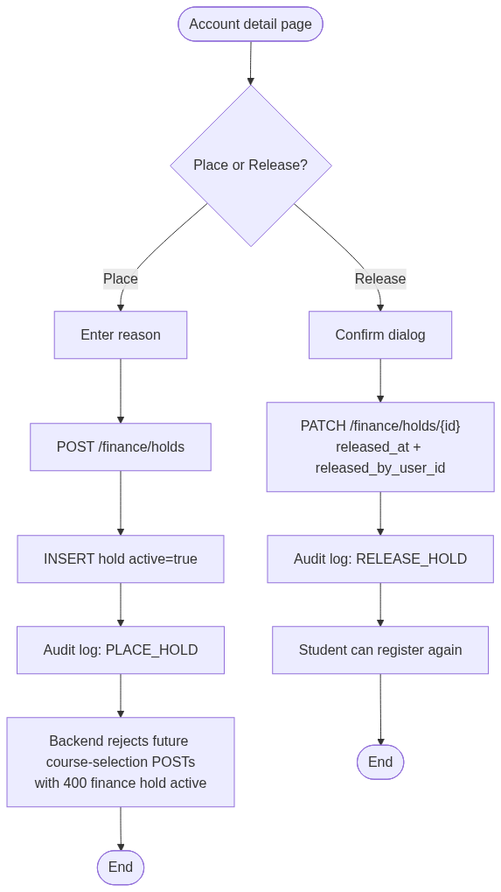
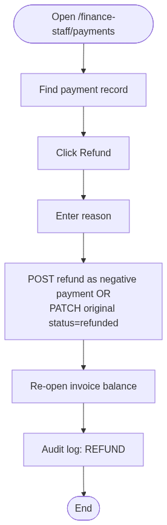
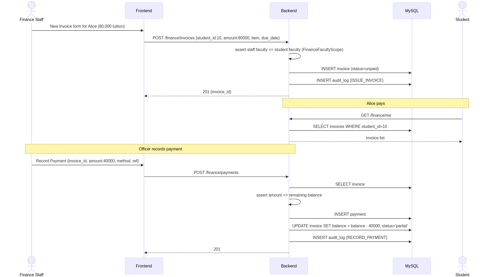
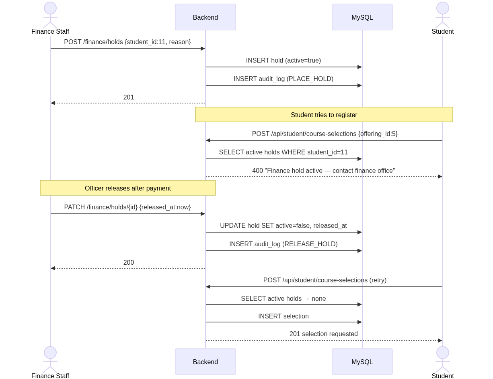
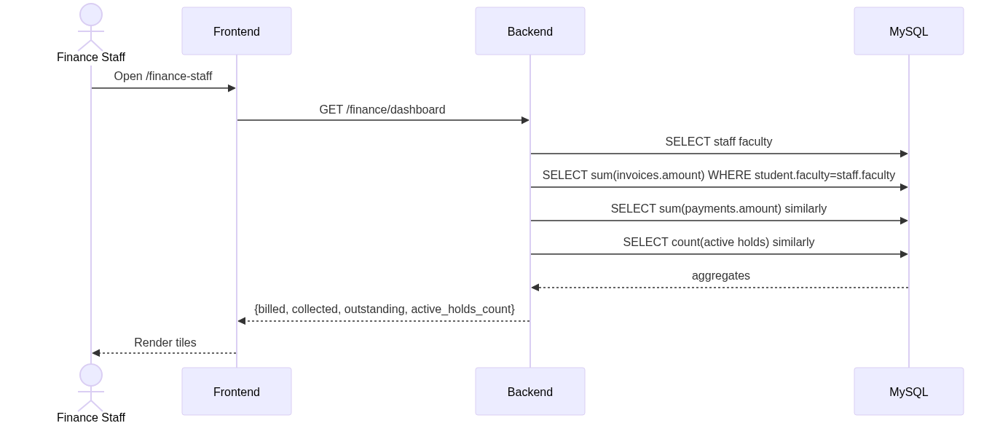

# Finance Staff — Rendered Diagrams

Auto-generated PNG renderings of every Mermaid diagram in this role's documentation. Source markdown links above each image.

## Use Cases

Source: [use-cases.md](../use-cases.md)

### Use Case Diagram

## Activity Diagrams

Source: [activity-diagrams.md](../activity-diagrams.md)

### A1 — Invoice → payment → balance update

### A2 — Faculty dashboard review

### A3 — Place / release hold

### A4 — Recording a refund (rare)

## Sequence Diagrams

Source: [sequence-diagrams.md](../sequence-diagrams.md)

### S1 — Issue invoice + record payment

### S2 — Place hold blocks registration

### S3 — Faculty-scoped dashboard

