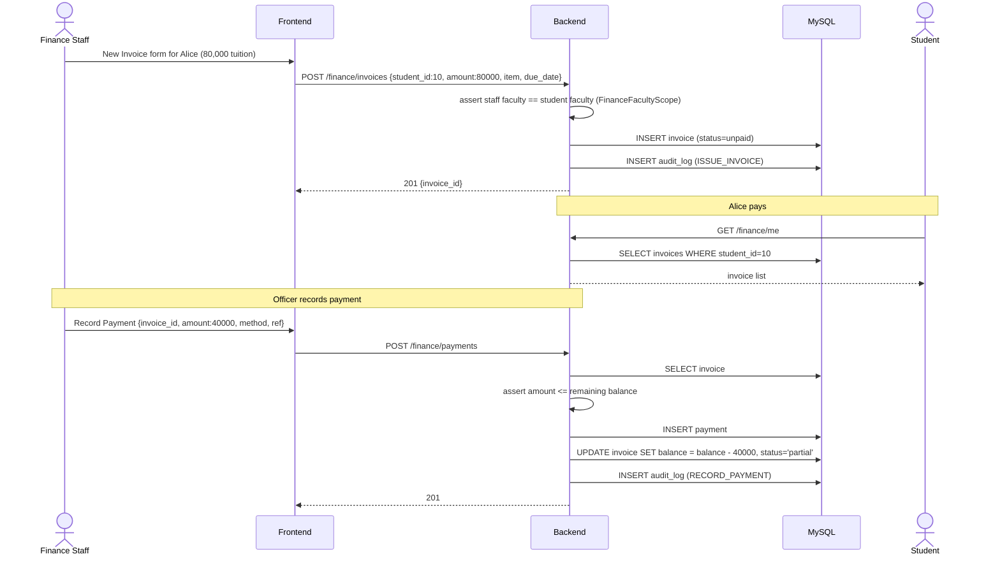
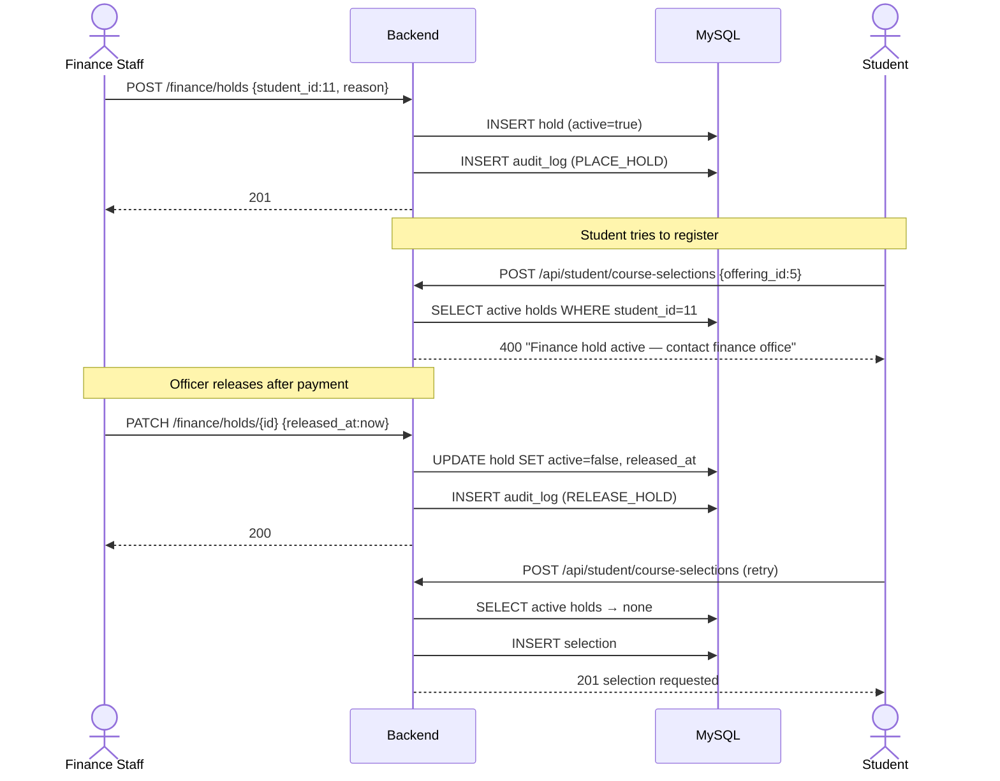
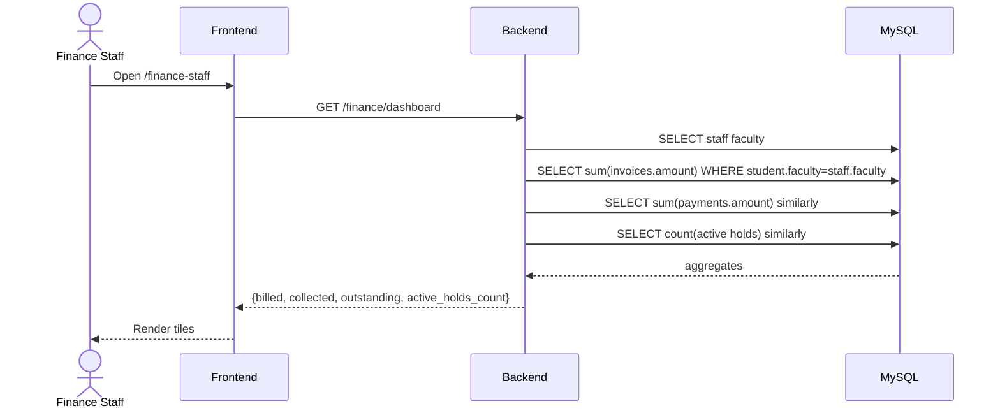

# Finance Staff — Sequence Diagrams

## S1 — Issue invoice + record payment

```mermaid
sequenceDiagram
    actor F as Finance Staff
    participant FE as Frontend
    participant API as Backend
    participant DB as MySQL
    actor S as Student

    F->>FE: New Invoice form for Alice (80,000 tuition)
    FE->>API: POST /finance/invoices {student_id:10, amount:80000, item, due_date}
    API->>API: assert staff faculty == student faculty (FinanceFacultyScope)
    API->>DB: INSERT invoice (status=unpaid)
    API->>DB: INSERT audit_log (ISSUE_INVOICE)
    API-->>FE: 201 {invoice_id}

    Note over S,API: Alice pays
    S->>API: GET /finance/me
    API->>DB: SELECT invoices WHERE student_id=10
    API-->>S: invoice list

    Note over F,API: Officer records payment
    F->>FE: Record Payment {invoice_id, amount:40000, method, ref}
    FE->>API: POST /finance/payments
    API->>DB: SELECT invoice
    API->>API: assert amount <= remaining balance
    API->>DB: INSERT payment
    API->>DB: UPDATE invoice SET balance = balance - 40000, status='partial'
    API->>DB: INSERT audit_log (RECORD_PAYMENT)
    API-->>FE: 201
```

## S2 — Place hold blocks registration

```mermaid
sequenceDiagram
    actor F as Finance Staff
    participant API as Backend
    participant DB as MySQL
    actor S as Student

    F->>API: POST /finance/holds {student_id:11, reason}
    API->>DB: INSERT hold (active=true)
    API->>DB: INSERT audit_log (PLACE_HOLD)
    API-->>F: 201

    Note over S,API: Student tries to register
    S->>API: POST /api/student/course-selections {offering_id:5}
    API->>DB: SELECT active holds WHERE student_id=11
    API-->>S: 400 "Finance hold active — contact finance office"

    Note over F,API: Officer releases after payment
    F->>API: PATCH /finance/holds/{id} {released_at:now}
    API->>DB: UPDATE hold SET active=false, released_at
    API->>DB: INSERT audit_log (RELEASE_HOLD)
    API-->>F: 200

    S->>API: POST /api/student/course-selections (retry)
    API->>DB: SELECT active holds → none
    API->>DB: INSERT selection
    API-->>S: 201 selection requested
```

## S3 — Faculty-scoped dashboard

```mermaid
sequenceDiagram
    actor F as Finance Staff
    participant FE as Frontend
    participant API as Backend
    participant DB as MySQL

    F->>FE: Open /finance-staff
    FE->>API: GET /finance/dashboard
    API->>DB: SELECT staff faculty
    API->>DB: SELECT sum(invoices.amount) WHERE student.faculty=staff.faculty
    API->>DB: SELECT sum(payments.amount) similarly
    API->>DB: SELECT count(active holds) similarly
    DB-->>API: aggregates
    API-->>FE: {billed, collected, outstanding, active_holds_count}
    FE-->>F: Render tiles
```
