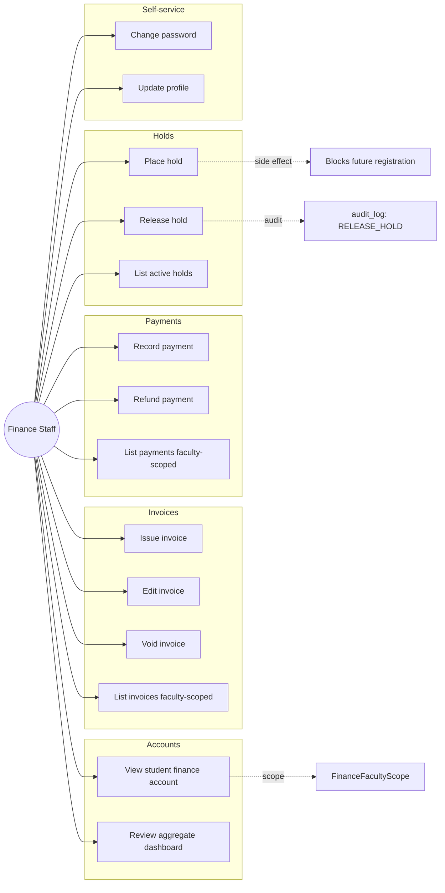

# Finance Staff — Use Cases

## Use Case Diagram

## Use Case Descriptions

### UC1 — Issue invoice
**Main flow:** `POST /finance/invoices { student_id, amount, item, due_date }`. Validation: student exists, amount > 0.

### UC5 — Record payment
**Main flow:** `POST /finance/payments { invoice_id, amount, method, reference }`. Validation: amount ≤ remaining balance.

### UC8 — Place hold
**Main flow:** `POST /finance/holds { student_id, reason }`. Audit log entry.

### UC9 — Release hold
**Main flow:** `PATCH /finance/holds/{id} { released_at, released_by_user_id }`. Audit log entry.

### UC11 — View student finance account
**Main flow:** `GET /finance/students/{id}` → invoices + payments + balance + active holds. Faculty-scoped.

### UC12 — Review aggregate dashboard
**Main flow:** `GET /finance/dashboard` → faculty totals (billed / collected / outstanding / active holds count).

### UC13 — Change password
**Main flow:** `POST /auth/change-password`.

### UC14 — Update profile
**Main flow:** `PUT /users/me { phone, etc. }`.
