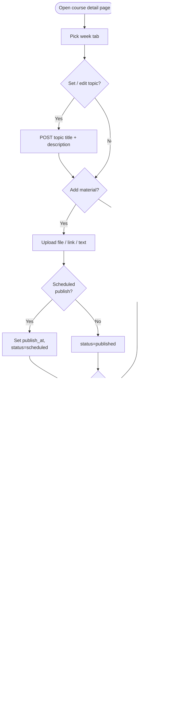
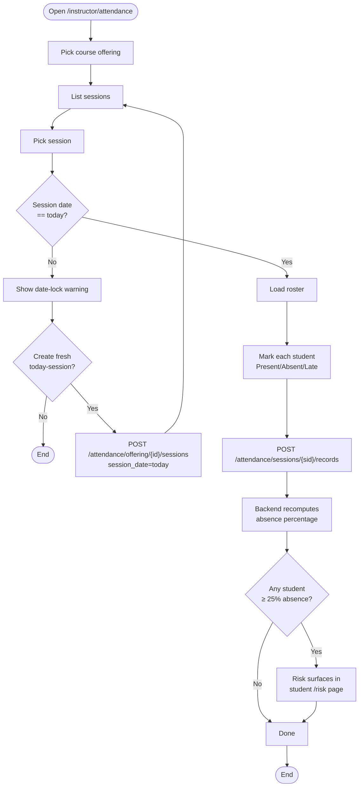
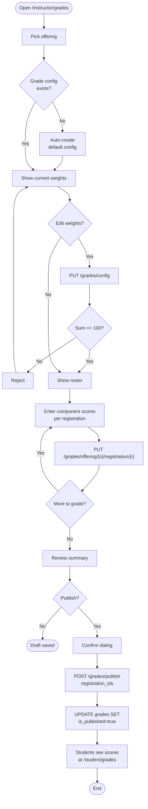
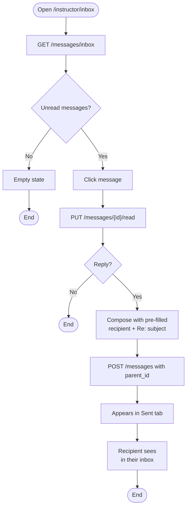

# Instructor — Activity Diagrams

## A1 — Weekly course setup (topic + material + assignment)

## A2 — Attendance marking (with date lock)

## A3 — Grade workflow (config → entry → publish)

## A4 — Reply to message

