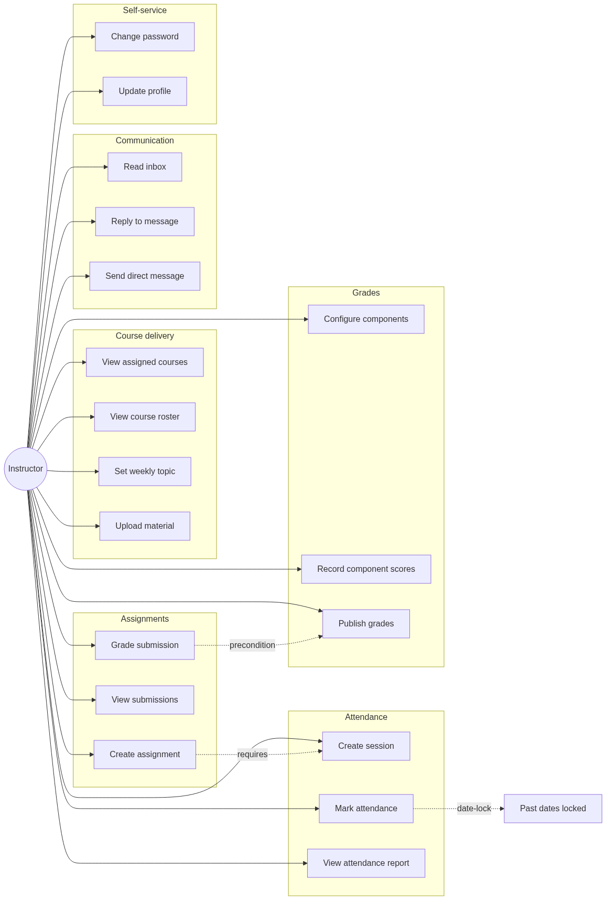
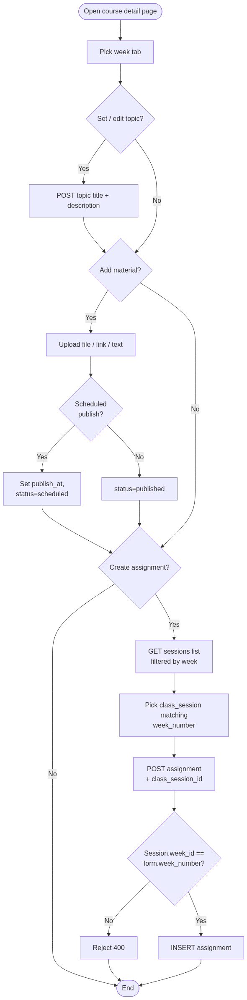
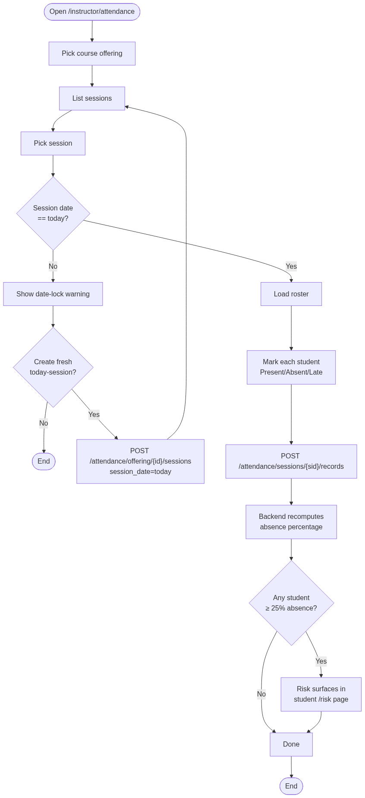
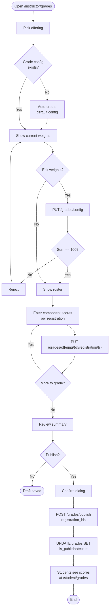
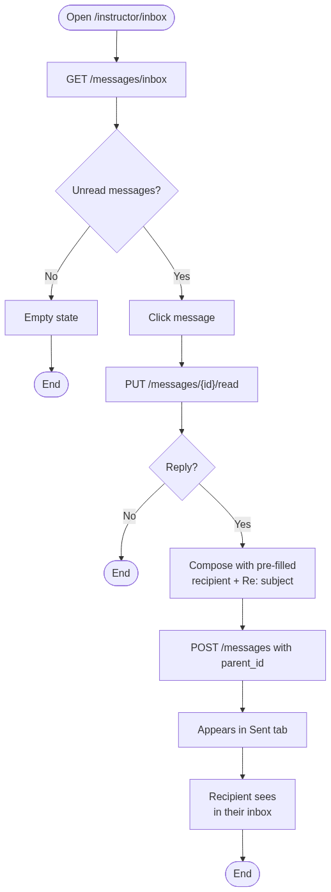
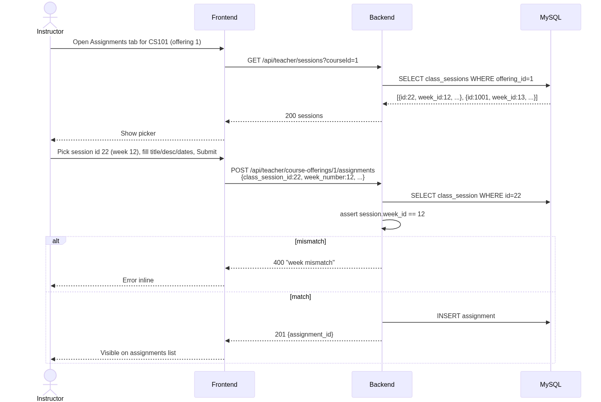
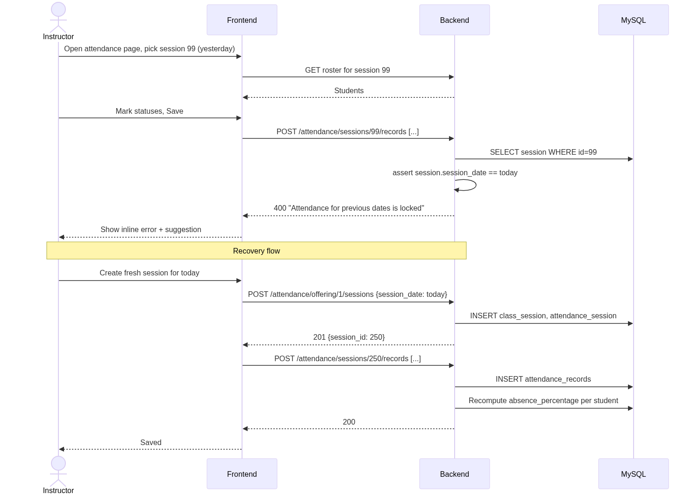
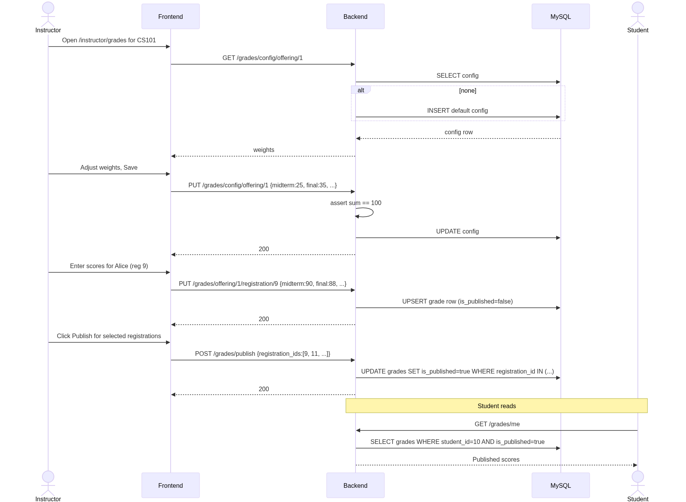
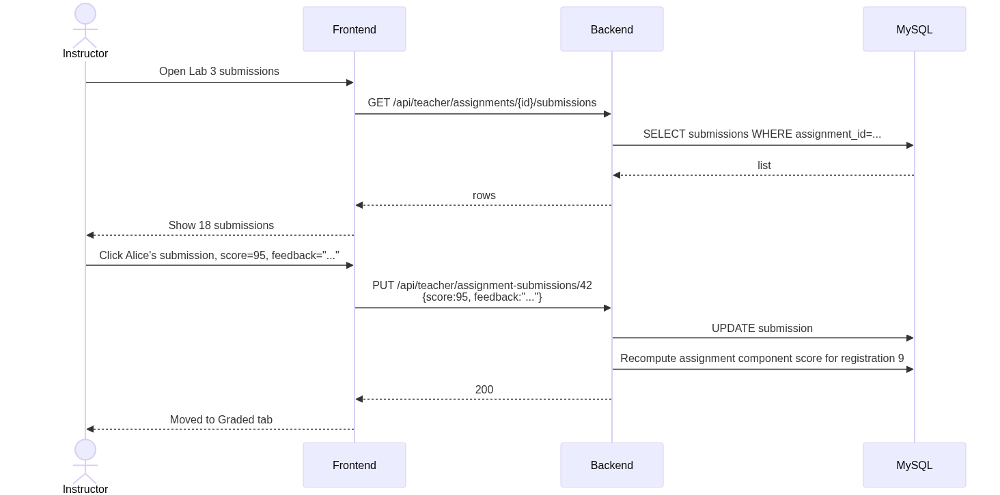

# Instructor — Rendered Diagrams

Auto-generated PNG renderings of every Mermaid diagram in this role's documentation. Source markdown links above each image.

## Use Cases

Source: [use-cases.md](../use-cases.md)

### Use Case Diagram

## Activity Diagrams

Source: [activity-diagrams.md](../activity-diagrams.md)

### A1 — Weekly course setup (topic + material + assignment)

### A2 — Attendance marking (with date lock)

### A3 — Grade workflow (config → entry → publish)

### A4 — Reply to message

## Sequence Diagrams

Source: [sequence-diagrams.md](../sequence-diagrams.md)

### S1 — Create assignment (with class_session linkage)

### S2 — Attendance bulk save with date-lock

### S3 — Grade configuration + publish

### S4 — Grade assignment submission

