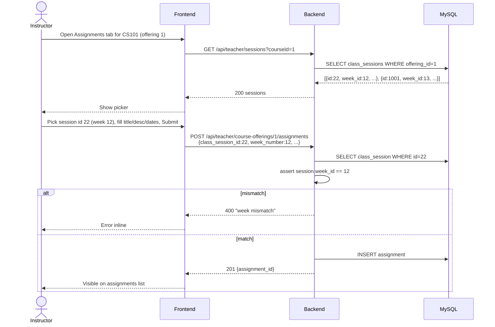
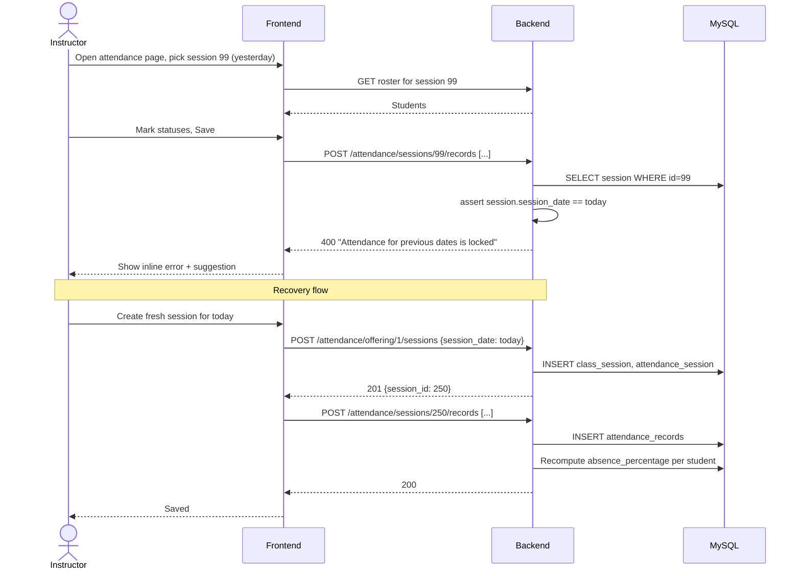
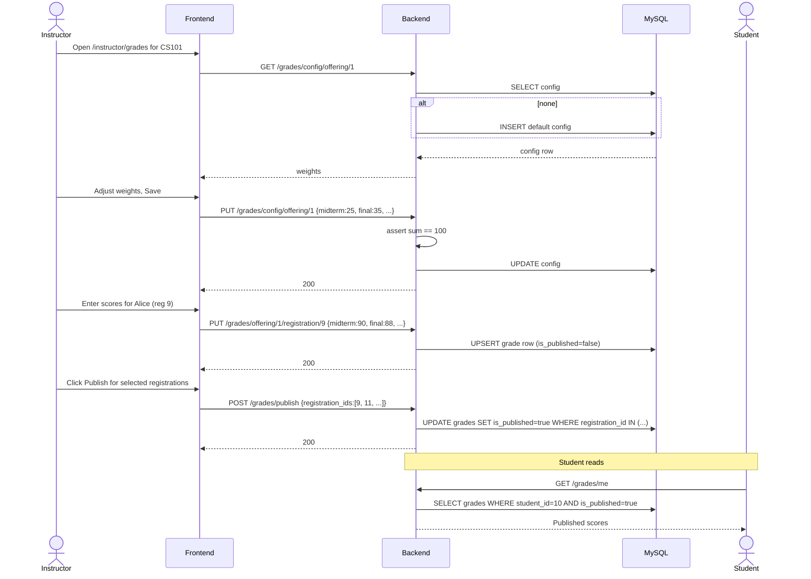
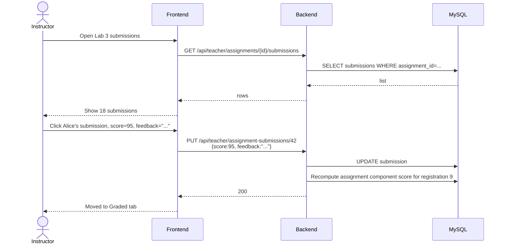

# Instructor — Sequence Diagrams

## S1 — Create assignment (with class_session linkage)

## S2 — Attendance bulk save with date-lock

## S3 — Grade configuration + publish

## S4 — Grade assignment submission

