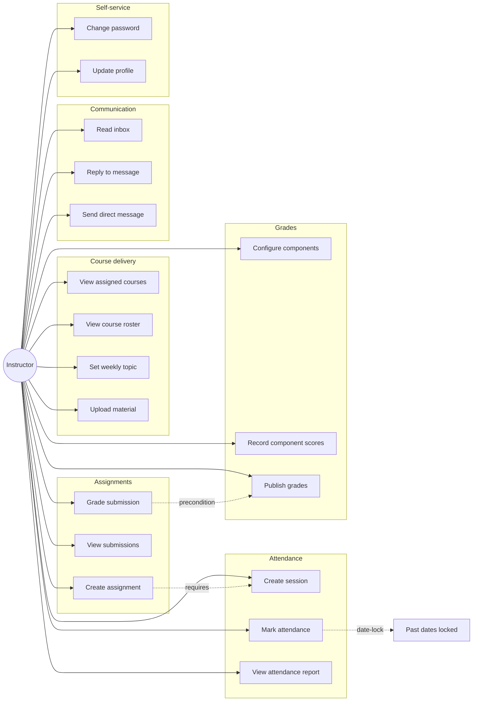

# Instructor — Use Cases

## Use Case Diagram

## Use Case Descriptions

### UC1 — View assigned courses
**Actor:** Instructor
**Main flow:** `GET /api/teacher/courses` returns offerings where `instructor_id = me`.

### UC2 — View course roster
**Actor:** Instructor
**Main flow:** Open course detail → `GET /api/teacher/course-offerings/{id}/registrations` returns active enrollments.

### UC3 — Set weekly topic
**Actor:** Instructor
**Main flow:** `POST /api/teacher/course-offerings/{id}/weeks/{w}/topic { title, description }`.
**Postcondition:** Topic drives the student week view.

### UC4 — Upload material
**Actor:** Instructor
**Main flow:** `POST /api/teacher/course-offerings/{id}/materials { week_number, file_url|link_url|text_content, status }`.
**Variant:** `status = 'scheduled'` with `publish_at` defers visibility until time arrives.

### UC5 — Create assignment
**Actor:** Instructor
**Preconditions:** A real `class_session_id` exists whose `week_id == form.week_number`.
**Main flow:** `POST /api/teacher/course-offerings/{id}/assignments { class_session_id, week_number, title, description, max_score, start_at, end_at }`.
**Exception:** If `class_session.week_id != week_number` → 400.

### UC6 — View submissions
**Actor:** Instructor
**Main flow:** `GET /api/teacher/assignments/{id}/submissions` returns list of student submissions.

### UC7 — Grade submission
**Actor:** Instructor
**Main flow:** `PUT /api/teacher/assignment-submissions/{id} { score, feedback }`.
**Postcondition:** Submission contributes to the assignment component score for the registration.

### UC8 — Create attendance session
**Actor:** Instructor
**Main flow:** `POST /attendance/offering/{id}/sessions { session_date, week_number, start_time, end_time }`.

### UC9 — Mark attendance
**Actor:** Instructor
**Preconditions:** Session date is today (date-lock).
**Main flow:** `POST /attendance/sessions/{sid}/records [{student_id, status, late_minutes}, ...]`.
**Exception:** Past-date bulk save → 400 "Attendance for previous dates is locked".

### UC10 — View attendance report
**Actor:** Instructor
**Main flow:** `GET /api/teacher/course-offerings/{id}/attendance-report` returns per-student absence percentage.

### UC11 — Configure grade components
**Actor:** Instructor
**Main flow:** `PUT /grades/config/offering/{id} { midterm_points, final_exam_points, ..., attendance_points }`.
**Validation:** Sum must total a configured cap (typically 100).

### UC12 — Record component scores
**Actor:** Instructor
**Main flow:** `PUT /grades/offering/{o}/registration/{r} { midterm_score, ... }`.

### UC13 — Publish grades
**Actor:** Instructor
**Main flow:** `POST /grades/publish { registration_ids }`.
**Postcondition:** `is_published` flips to true; students see scores via `GET /grades/me`.

### UC14 — Read inbox
**Actor:** Instructor
**Main flow:** `GET /messages/inbox` filters to `recipient_id = me OR broadcast`.

### UC15 — Reply to message
**Actor:** Instructor
**Main flow:** Click Reply → `POST /messages { recipient_id, subject: "Re: ...", body, parent_id }`.

### UC16 — Send direct message
**Actor:** Instructor
**Main flow:** Same as Reply but with a fresh subject and recipient picked from contacts.

### UC17 — Change password
**Actor:** Instructor
**Main flow:** `POST /auth/change-password { current_password, new_password }`.

### UC18 — Update profile
**Actor:** Instructor
**Main flow:** `PUT /users/me { phone, bio, office_hours, ... }`.
