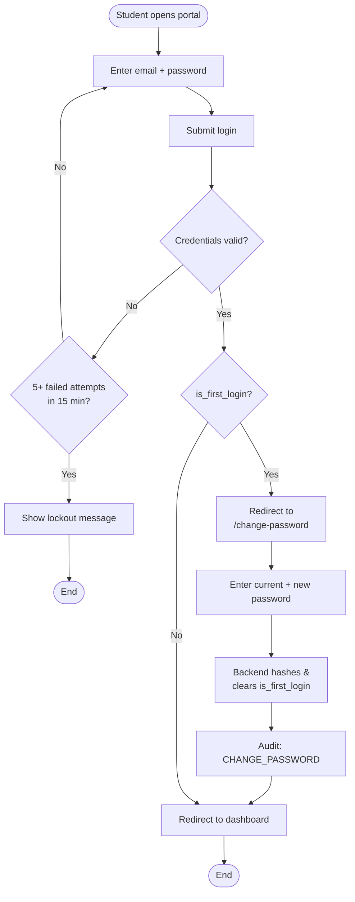
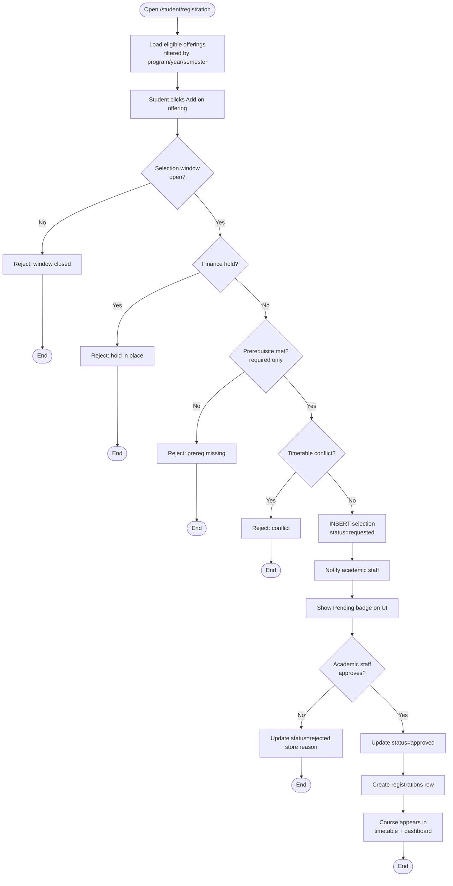
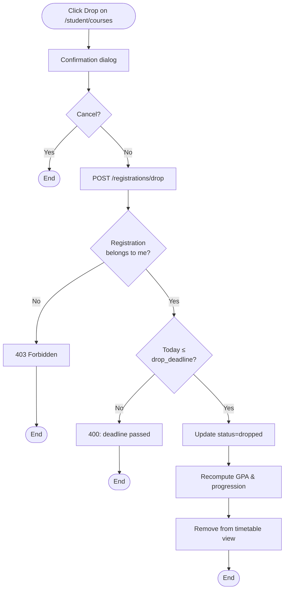
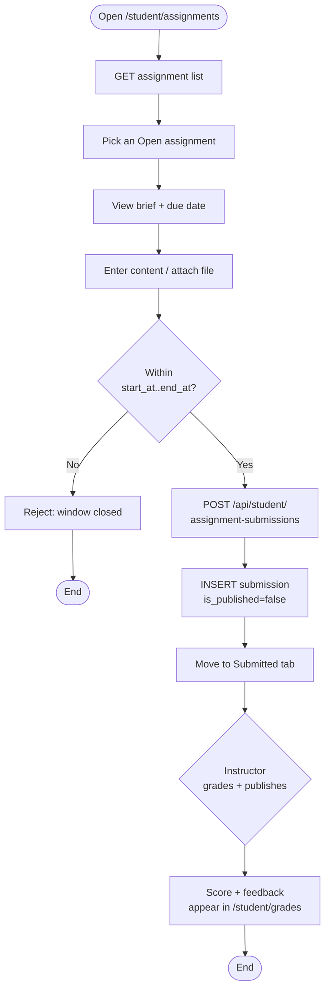
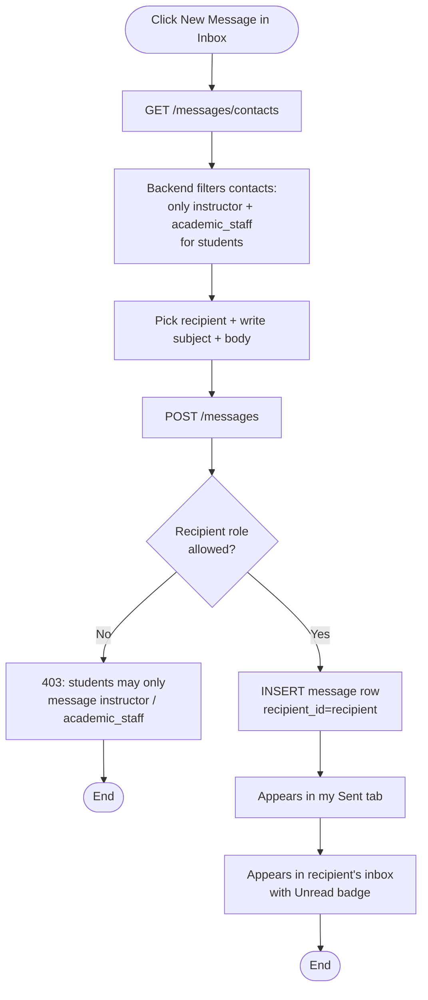
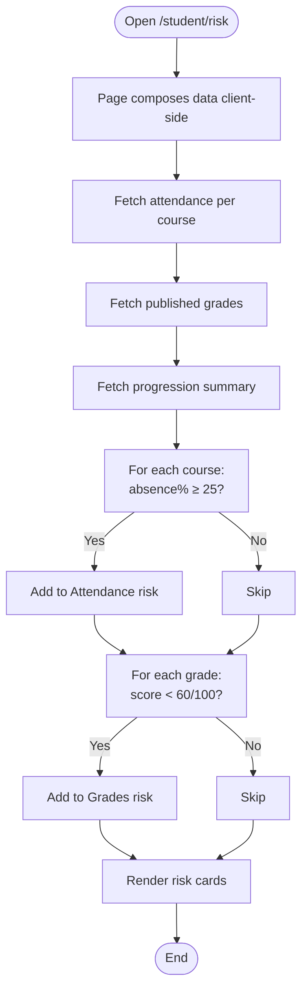

# Student — Activity Diagrams

All diagrams are rendered with Mermaid and display natively on GitHub.

## A1 — Login + First-time password change

## A2 — Course registration (selection → approval)

## A3 — Drop course

## A4 — Submit assignment

## A5 — Send direct message

## A6 — View risk warnings

