# Student — Rendered Diagrams

Auto-generated PNG renderings of every Mermaid diagram in this role's documentation. Source markdown links above each image.

## Use Cases

Source: [use-cases.md](../use-cases.md)

### Use Case Diagram

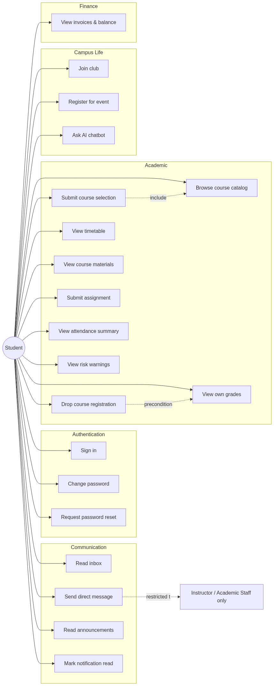

## Activity Diagrams

Source: [activity-diagrams.md](../activity-diagrams.md)

### A1 — Login + First-time password change

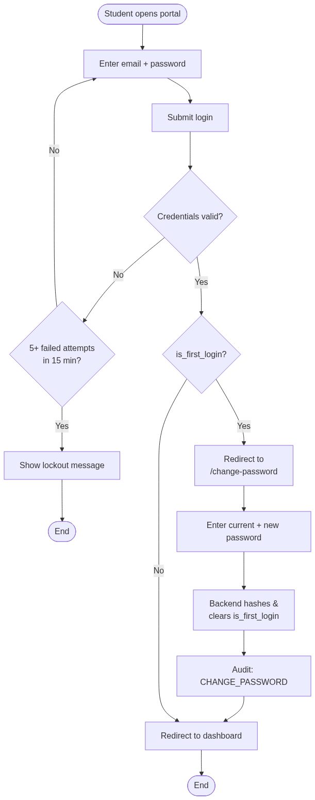

### A2 — Course registration (selection → approval)

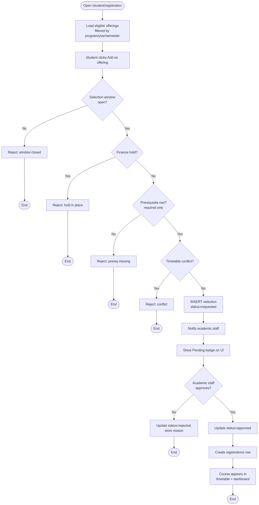

### A3 — Drop course

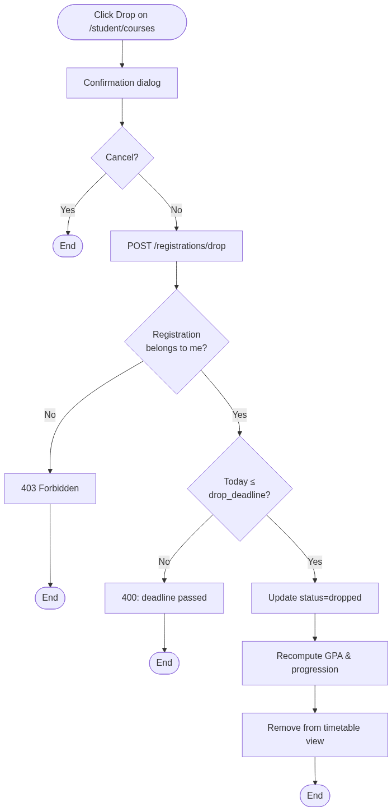

### A4 — Submit assignment

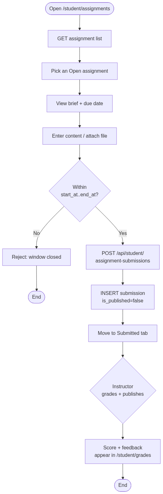

### A5 — Send direct message

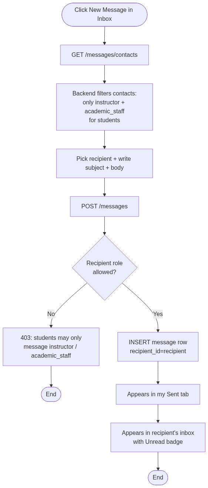

### A6 — View risk warnings

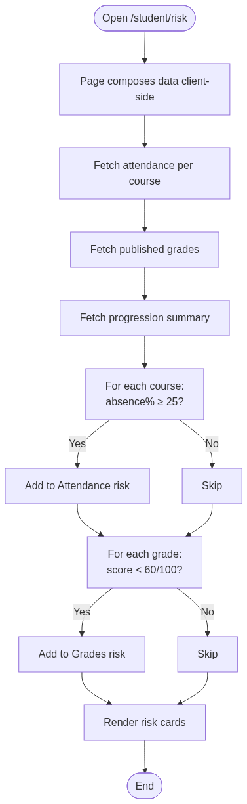

## Sequence Diagrams

Source: [sequence-diagrams.md](../sequence-diagrams.md)

### S1 — Login + JWT issuance

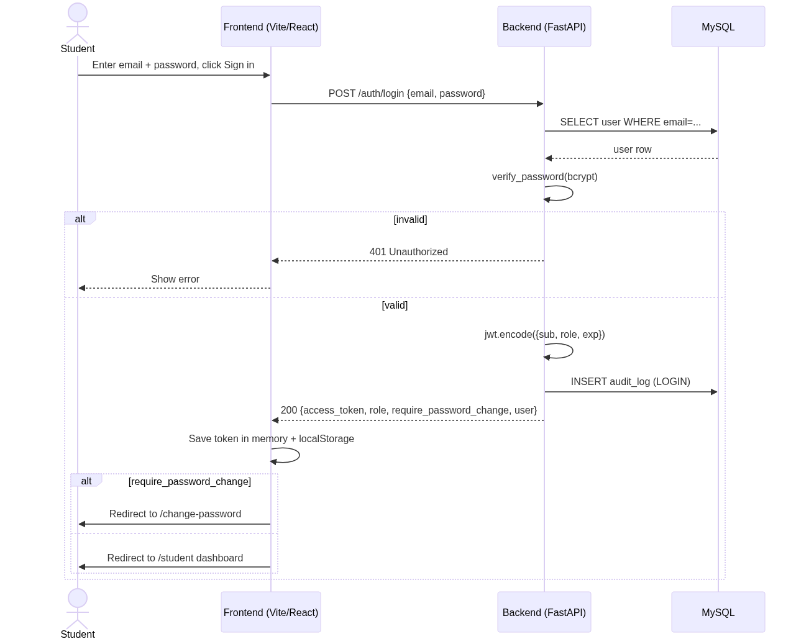

### S2 — Submit course selection

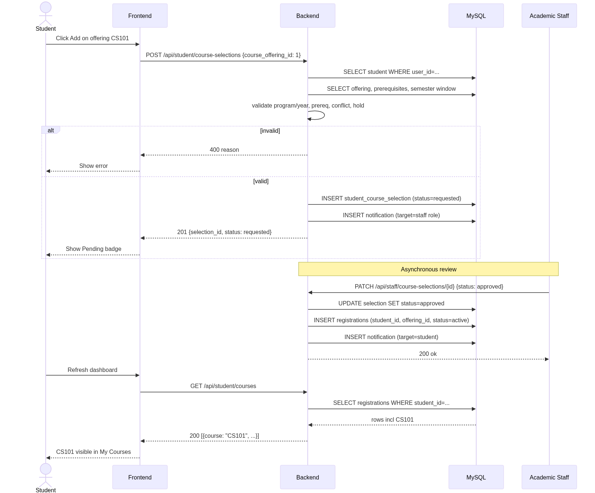

### S3 — Submit assignment + receive grade

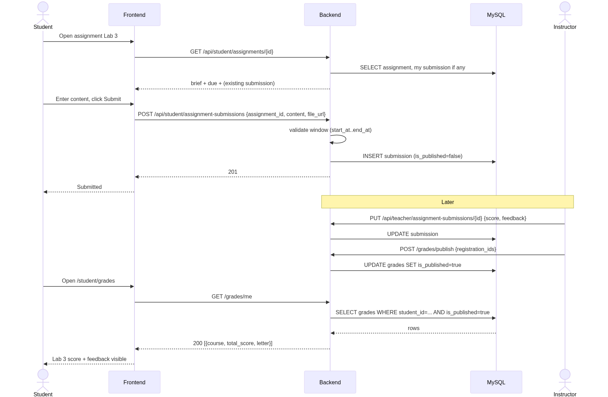

### S4 — Send direct message to instructor

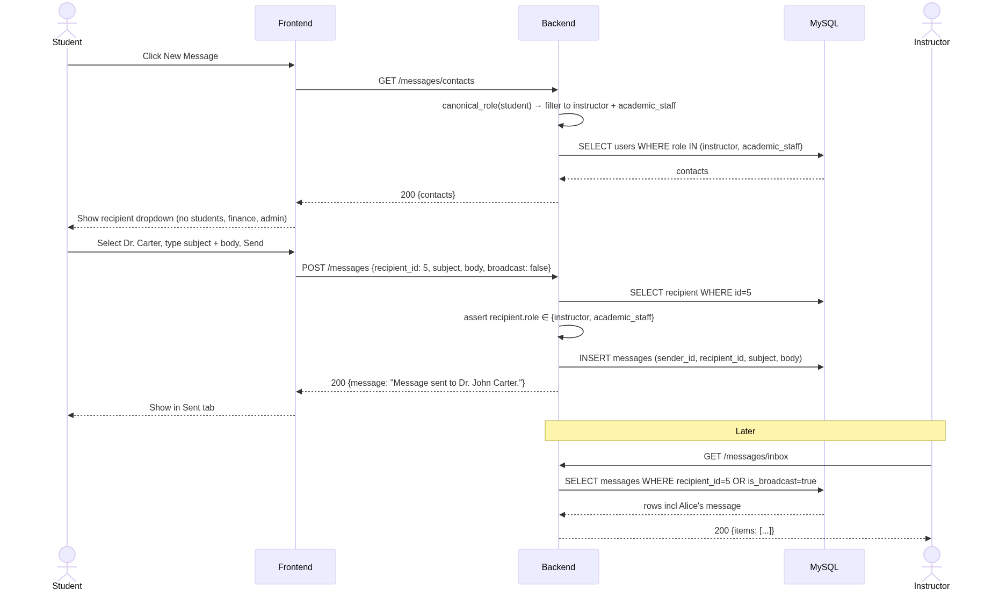

### S5 — Drop course (with deadline check)

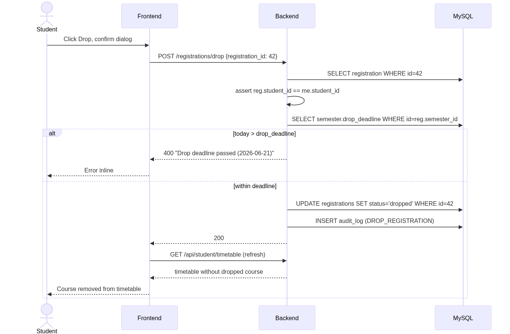
