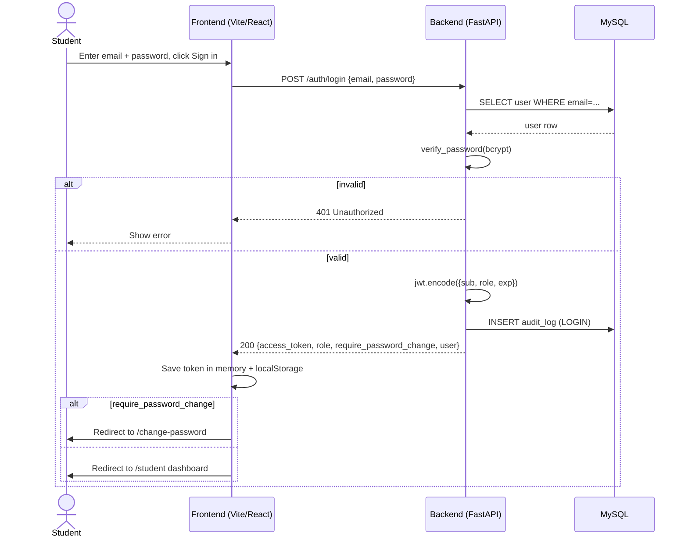
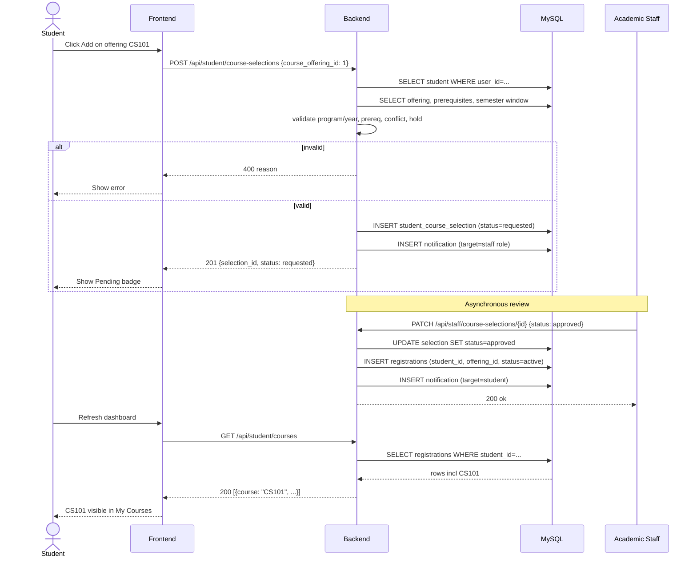
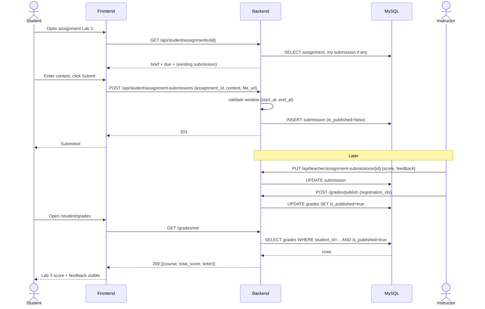
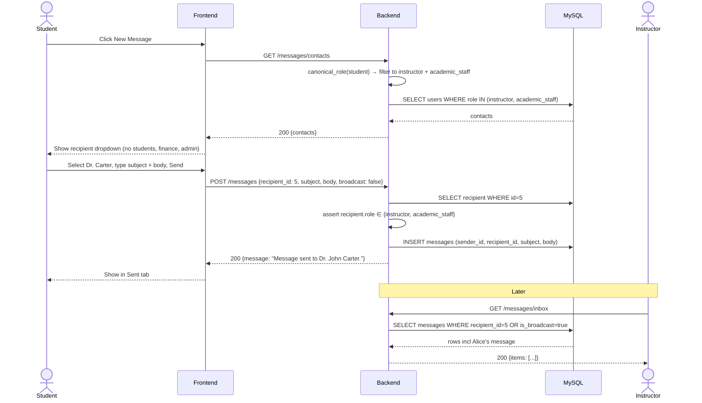
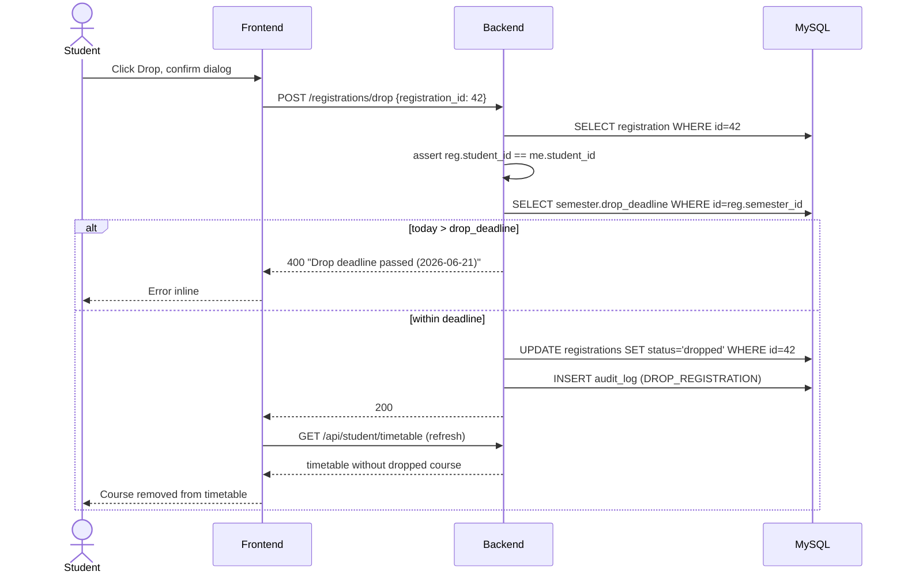

# Student — Sequence Diagrams

System-interaction views of the same flows. Useful when implementing or debugging API contracts.

## S1 — Login + JWT issuance

## S2 — Submit course selection

## S3 — Submit assignment + receive grade

## S4 — Send direct message to instructor

## S5 — Drop course (with deadline check)

