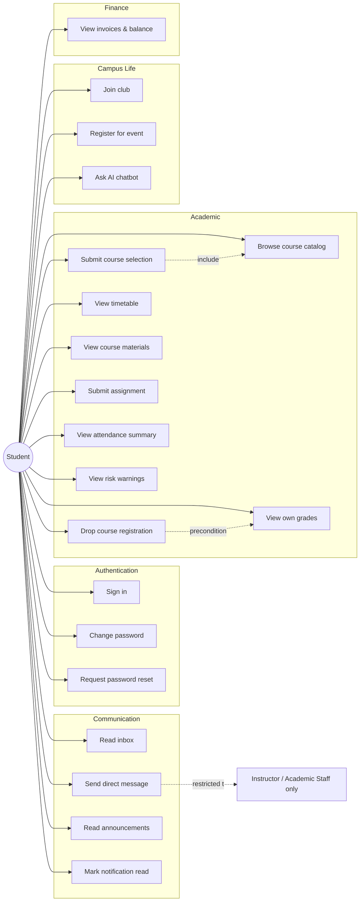

# Student — Use Cases

## Use Case Diagram

## Use Case Descriptions

### UC1 — Sign in
**Actor:** Student
**Goal:** Obtain an authenticated session.
**Preconditions:** Account exists and is active.
**Main flow:** Enter email + password → backend validates → JWT issued.
**Exception:** Invalid credentials → 401. After 5 failures within 15 min → temporary lockout (NFR-003).

### UC4 — Browse course catalog
**Actor:** Student
**Goal:** See offerings available for the active semester.
**Main flow:** Open `/student/available-subjects` → backend returns offerings filtered by student's faculty/program/year and semester window.

### UC5 — Submit course selection
**Actor:** Student
**Goal:** Request enrollment in an offering.
**Preconditions:** Active semester registration window open. No finance hold. Prerequisite satisfied (for required courses).
**Main flow:** Click **Add** on offering → `POST /api/student/course-selections` → row inserted with `status = 'requested'`.
**Postcondition:** Academic staff sees a pending request.

### UC6 — Drop course registration
**Actor:** Student
**Preconditions:** Registration exists, current date ≤ `semester.drop_deadline`.
**Main flow:** Click **Drop** → confirm → `POST /registrations/drop`.
**Exception:** Past deadline → 400, registration unchanged.

### UC7 — View timetable
**Actor:** Student
**Goal:** See weekly schedule.
**Main flow:** Open `/student/timetable` → `GET /api/student/timetable` returns deduplicated class_sessions for current week.

### UC8 — View course materials
**Actor:** Student
**Main flow:** Open `/student/courses/:id` → week tab → `GET /api/student/courses/{id}/weeks/{w}/materials` returns topic + materials + weekly tasks.

### UC9 — Submit assignment
**Actor:** Student
**Preconditions:** Assignment is open (between `start_at` and `end_at`).
**Main flow:** Open assignment → enter content / attach file → `POST /api/student/assignment-submissions`.

### UC10 — View own grades
**Actor:** Student
**Main flow:** `GET /grades/me` returns only `is_published = true` grades.

### UC11 — View attendance summary
**Actor:** Student
**Main flow:** `/student/attendance` → summary cards + per-course color table; computed from `attendance_records`.

### UC12 — View risk warnings
**Actor:** Student
**Main flow:** `/student/risk` → composes attendance + grades client-side; flags absences ≥ 25% and grades below pass mark.

### UC13 — Read inbox
**Actor:** Student
**Main flow:** `GET /messages/inbox` (filtered to `recipient_id = me OR broadcast`) + `GET /notifications`.

### UC14 — Send direct message
**Actor:** Student
**Preconditions:** Recipient is instructor or academic staff (backend rejects others).
**Main flow:** Compose → `POST /messages { recipient_id, subject, body, broadcast: false }`.
**Exception:** Recipient is student/finance/admin → 403.

### UC17 — Join club
**Actor:** Student
**Main flow:** `POST /clubs/{id}/join` → membership row `status = 'requested'`; communications staff approves/rejects.

### UC19 — Ask AI chatbot
**Actor:** Student
**Main flow:** Open `/student/chatbot`; query is enriched with student context (registered offerings, grades summary); sent to local Ollama if available, else deterministic fallback.

### UC20 — View invoices & balance
**Actor:** Student
**Main flow:** Finance summary on dashboard → `GET /finance/me` returns invoices, payments, balance, holds.
