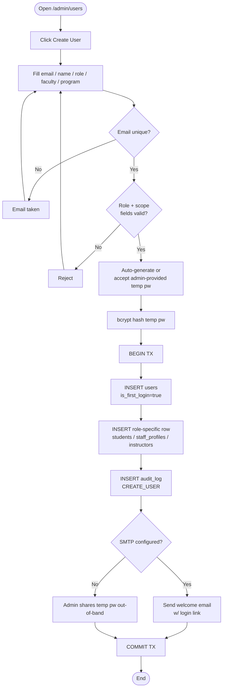
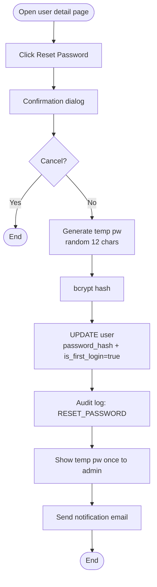
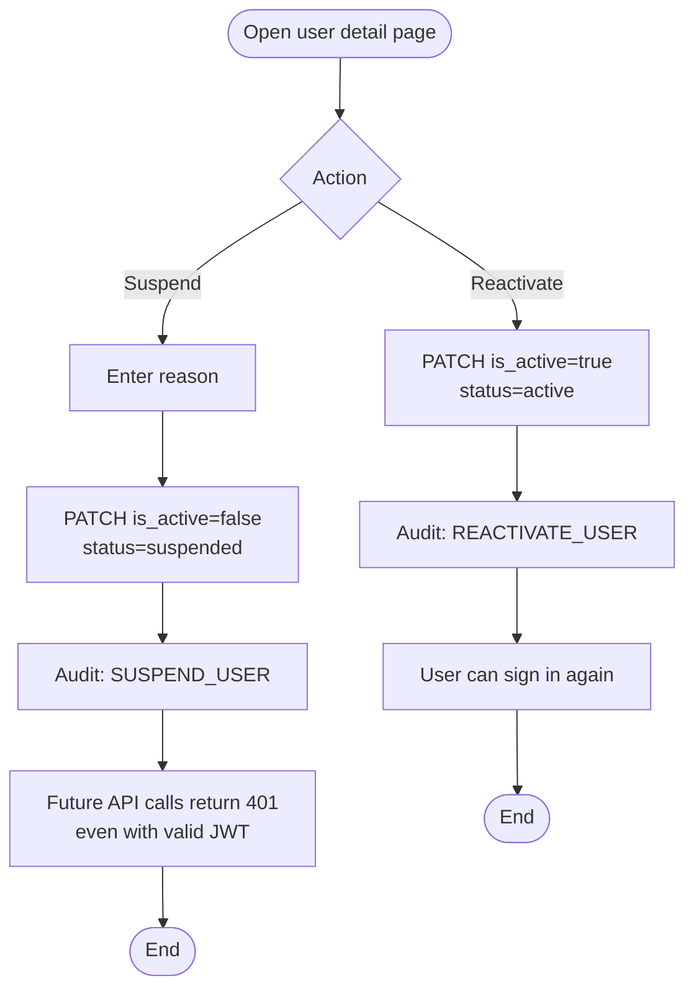
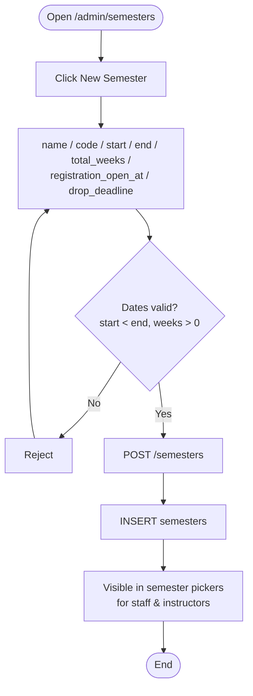
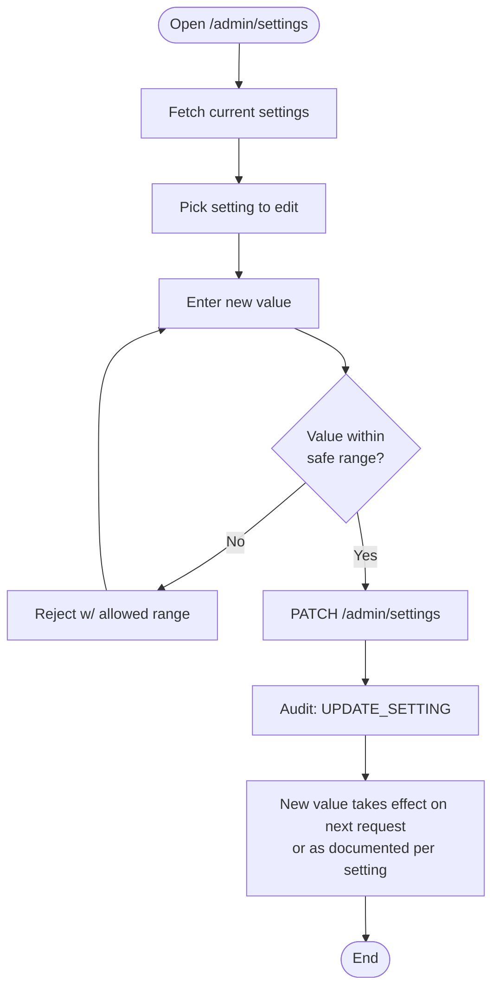

# System Admin — Activity Diagrams

## A1 — User provisioning

```mermaid
flowchart TD
    Start([Open /admin/users]) --> New[Click Create User]
    New --> Fill[Fill email / name / role / faculty / program]
    Fill --> Validate{Email unique?}
    Validate -- No --> ErrE[Email taken]
    ErrE --> Fill
    Validate -- Yes --> ValidateRole{Role + scope<br/>fields valid?}
    ValidateRole -- No --> ErrR[Reject]
    ErrR --> Fill
    ValidateRole -- Yes --> GenPW[Auto-generate or<br/>accept admin-provided temp pw]
    GenPW --> Hash[bcrypt hash temp pw]
    Hash --> Tx[BEGIN TX]
    Tx --> Insert[INSERT users<br/>is_first_login=true]
    Insert --> RoleRow[INSERT role-specific row<br/>students / staff_profiles / instructors]
    RoleRow --> Audit[INSERT audit_log<br/>CREATE_USER]
    Audit --> Email{SMTP configured?}
    Email -- Yes --> SendEmail[Send welcome email<br/>w/ login link]
    Email -- No --> AdminShare[Admin shares temp pw out-of-band]
    SendEmail --> Commit
    AdminShare --> Commit
    Commit[COMMIT TX] --> End([End])
```

## A2 — Password reset

```mermaid
flowchart TD
    Start([Open user detail page]) --> Click[Click Reset Password]
    Click --> Confirm[Confirmation dialog]
    Confirm --> Cancel{Cancel?}
    Cancel -- Yes --> End1([End])
    Cancel -- No --> Gen[Generate temp pw<br/>random 12 chars]
    Gen --> Hash[bcrypt hash]
    Hash --> Update[UPDATE user<br/>password_hash + is_first_login=true]
    Update --> Audit[Audit log: RESET_PASSWORD]
    Audit --> Share[Show temp pw once to admin]
    Share --> Notify[Send notification email]
    Notify --> End2([End])
```

## A3 — Suspend / reactivate

```mermaid
flowchart TD
    Start([Open user detail page]) --> Choice{Action}
    Choice -- Suspend --> SuspReason[Enter reason]
    SuspReason --> SuspPatch[PATCH is_active=false<br/>status=suspended]
    SuspPatch --> Audit1[Audit: SUSPEND_USER]
    Audit1 --> Effect1[Future API calls return 401<br/>even with valid JWT]
    Effect1 --> End1([End])
    Choice -- Reactivate --> ReactivatePatch[PATCH is_active=true<br/>status=active]
    ReactivatePatch --> Audit2[Audit: REACTIVATE_USER]
    Audit2 --> Effect2[User can sign in again]
    Effect2 --> End2([End])
```

## A4 — Create semester

```mermaid
flowchart TD
    Start([Open /admin/semesters]) --> New[Click New Semester]
    New --> Fill[name / code / start / end / total_weeks /<br/>registration_open_at / drop_deadline]
    Fill --> Validate{Dates valid?<br/>start < end, weeks > 0}
    Validate -- No --> Err[Reject]
    Err --> Fill
    Validate -- Yes --> Post[POST /semesters]
    Post --> Store[INSERT semesters]
    Store --> Visible[Visible in semester pickers<br/>for staff & instructors]
    Visible --> End([End])
```

## A5 — System settings change

```mermaid
flowchart TD
    Start([Open /admin/settings]) --> View[Fetch current settings]
    View --> Pick[Pick setting to edit]
    Pick --> Edit[Enter new value]
    Edit --> Validate{Value within<br/>safe range?}
    Validate -- No --> Err[Reject w/ allowed range]
    Err --> Edit
    Validate -- Yes --> Save[PATCH /admin/settings]
    Save --> Audit[Audit: UPDATE_SETTING]
    Audit --> Effect[New value takes effect on next request<br/>or as documented per setting]
    Effect --> End([End])
```
