# System Admin — Rendered Diagrams

Auto-generated PNG renderings of every Mermaid diagram in this role's documentation. Source markdown links above each image.

## Use Cases

Source: [use-cases.md](../use-cases.md)

### Use Case Diagram

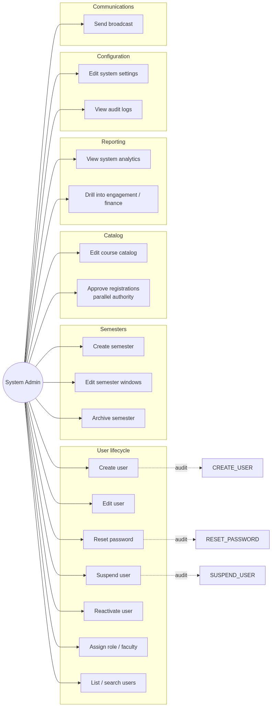

## Activity Diagrams

Source: [activity-diagrams.md](../activity-diagrams.md)

### A1 — User provisioning

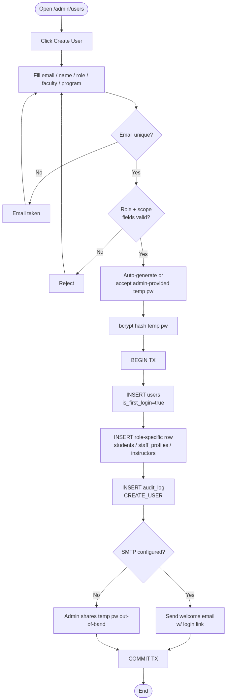

### A2 — Password reset

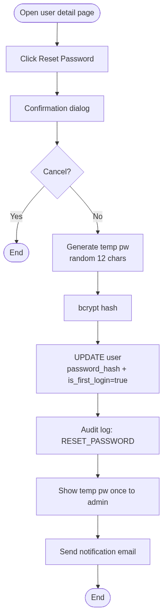

### A3 — Suspend / reactivate

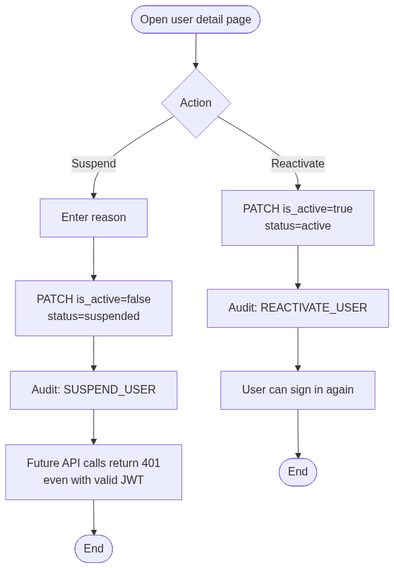

### A4 — Create semester

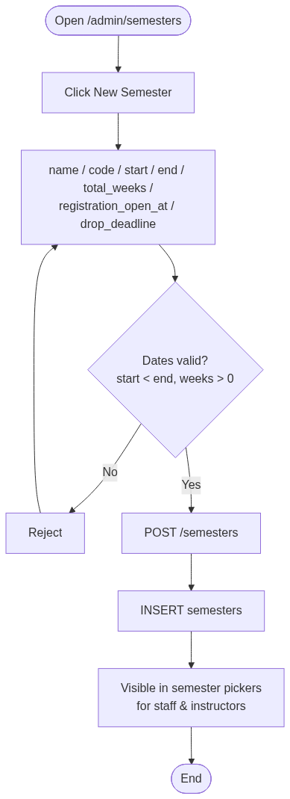

### A5 — System settings change

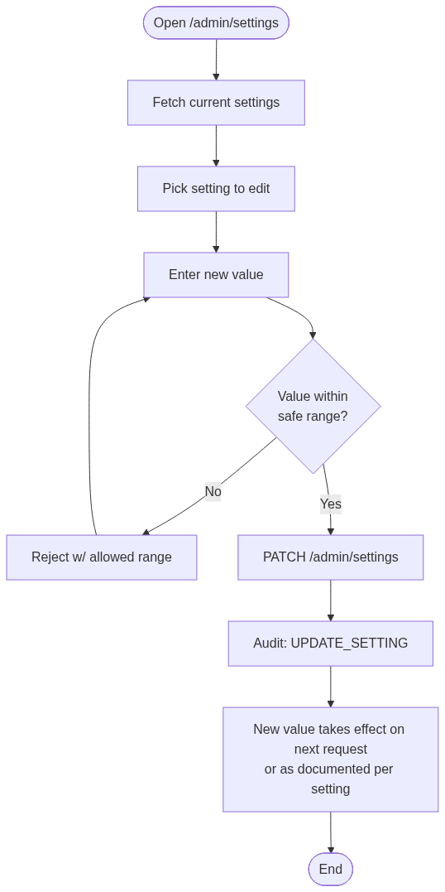

## Sequence Diagrams

Source: [sequence-diagrams.md](../sequence-diagrams.md)

### S1 — Provision new user

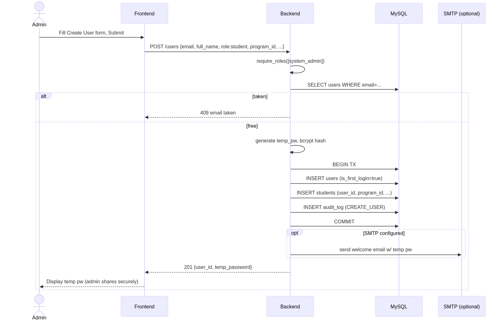

### S2 — Reset password

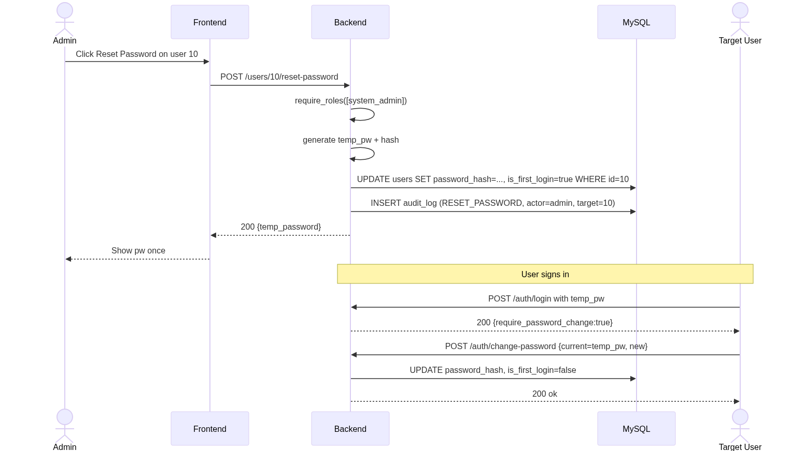

### S3 — Suspend (with effect on existing token)

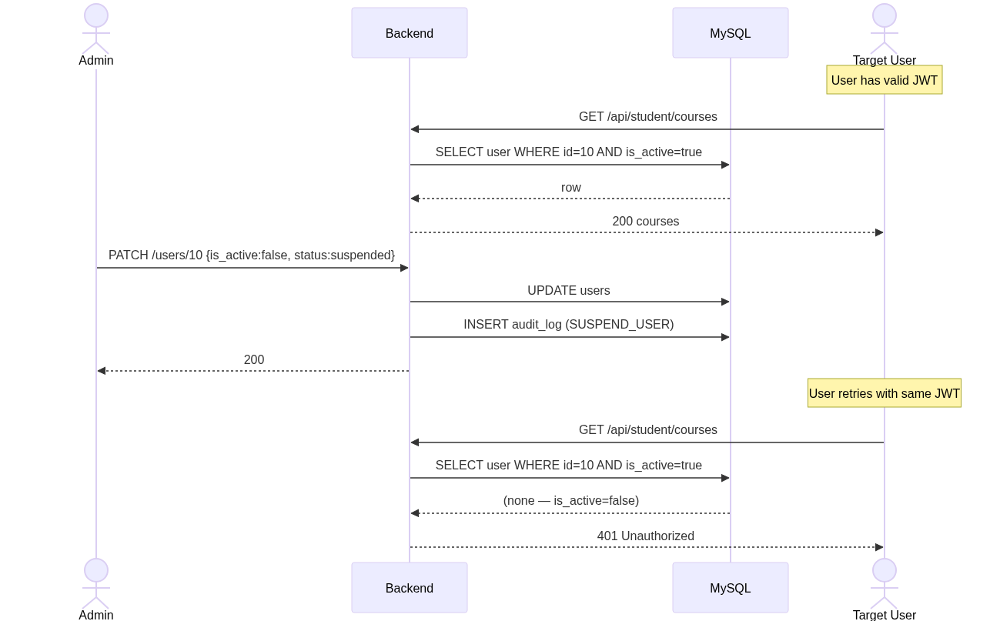

### S4 — Edit semester windows

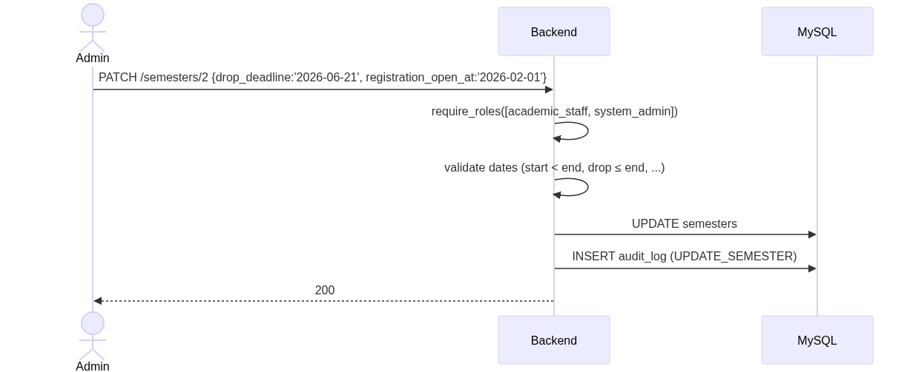

### S5 — Analytics snapshot

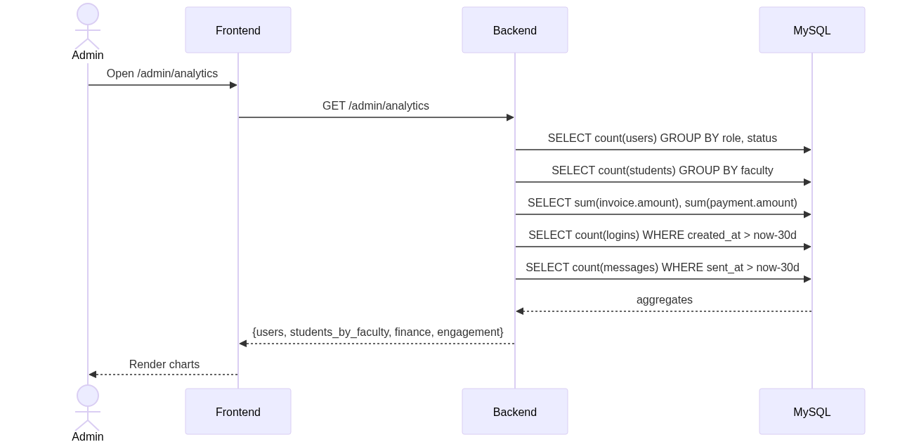
