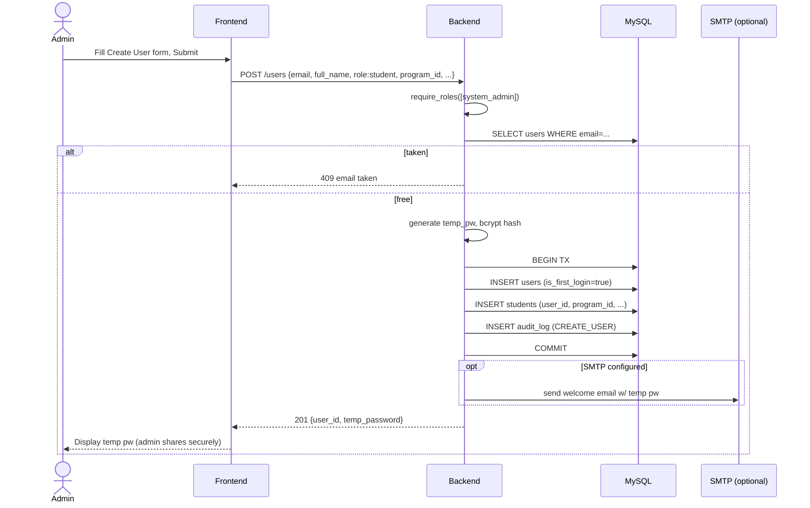
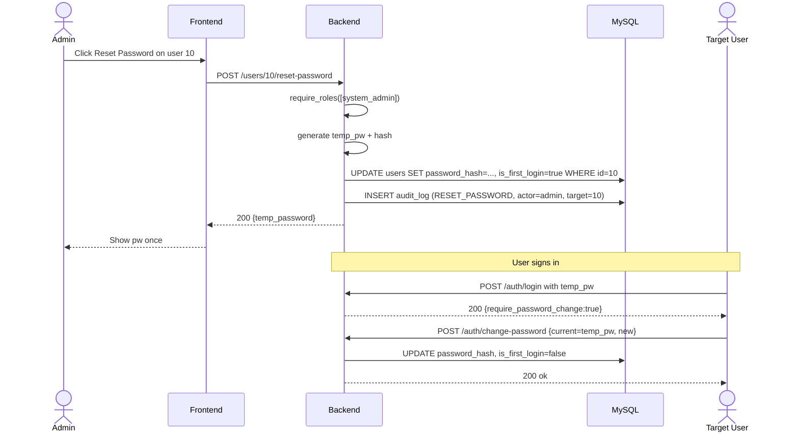
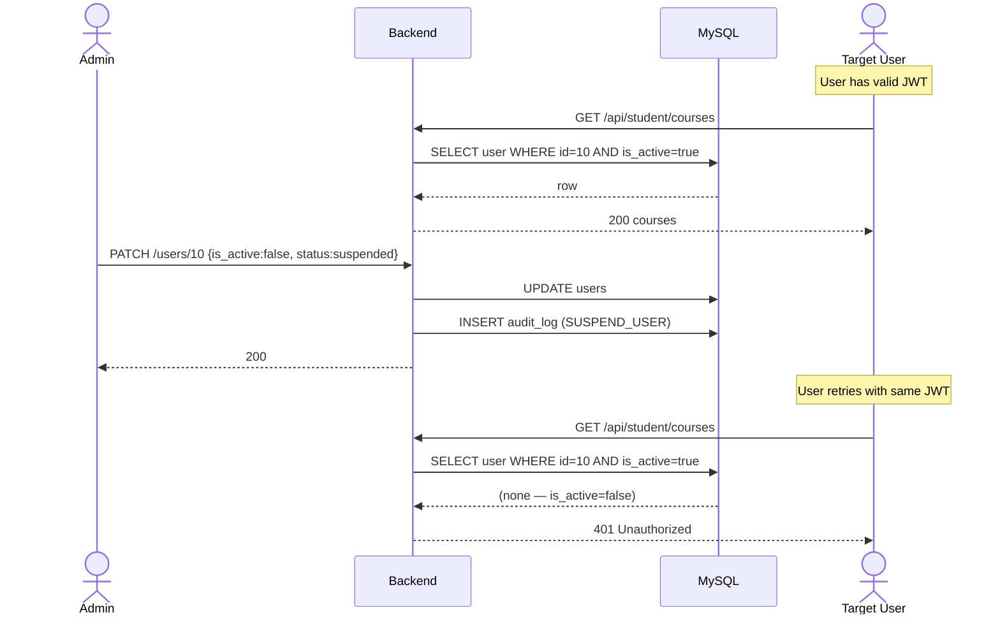
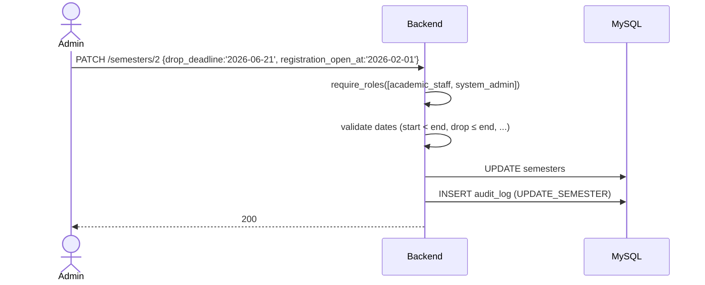
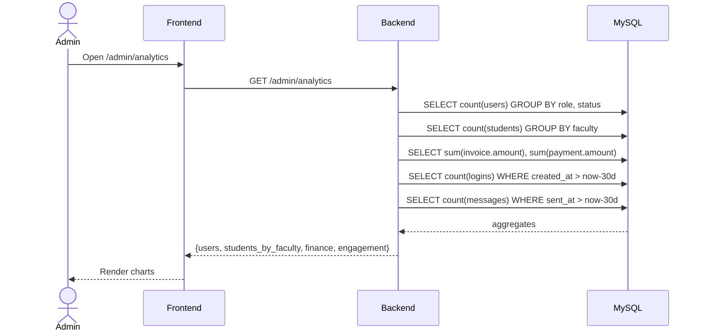

# System Admin — Sequence Diagrams

## S1 — Provision new user

## S2 — Reset password

## S3 — Suspend (with effect on existing token)

## S4 — Edit semester windows

## S5 — Analytics snapshot

