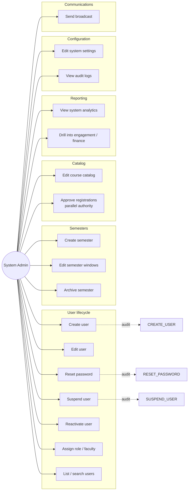

# System Admin — Use Cases

## Use Case Diagram

## Use Case Descriptions

### UC1 — Create user
**Main flow:** `POST /users { email, full_name, role, faculty_id, program_id, degree_level }`.
**Side effect:** Creates `users` + role-specific row (`students` / `staff_profiles` / `instructors`).
**Postcondition:** `is_first_login = true`; user must change password on first login.

### UC2 — Edit user
**Main flow:** `PATCH /users/{id} { fields }`. Cannot change email on existing user (institutional policy).

### UC3 — Reset password
**Main flow:** `POST /users/{id}/reset-password`. Generates temp password; sets `is_first_login = true`.

### UC4 — Suspend user
**Main flow:** `PATCH /users/{id} { is_active: false, status: 'suspended' }`. Backend re-checks `is_active` on every API call.

### UC5 — Reactivate user
**Main flow:** `PATCH /users/{id} { is_active: true, status: 'active' }`.

### UC6 — Assign role / faculty
**Main flow:** Same as UC2 but with role change. Demotions audit-logged with reason.

### UC8 — Create semester
**Main flow:** `POST /semesters { name, code, dates, total_weeks }`.

### UC9 — Edit semester windows
**Main flow:** `PATCH /semesters/{id} { registration_open_at, drop_deadline }`.

### UC13 — View analytics
**Main flow:** `GET /admin/analytics` aggregates across all faculties.

### UC15 — Edit system settings
**Main flow:** `PATCH /admin/settings { ... }`. Each setting has safe-range validation.

### UC16 — View audit logs
**Main flow:** `GET /admin/audit-log?action=...&actor=...&since=...&until=...`.

### UC17 — Send broadcast
**Main flow:** `POST /messages { broadcast: true, ... }`. Backend allows because admin role.
