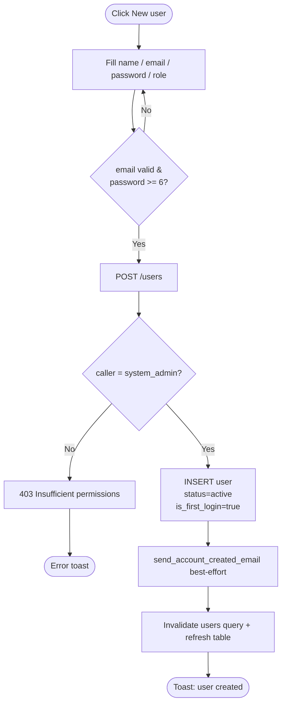

# System Admin — Activity Diagrams

## A1 — Approve / refuse a pending account

```mermaid
flowchart TD
    Start([Open /admin/users]) --> Load[GET /users/pending]
    Load --> Show[Show 'awaiting approval' card]
    Show --> Pick[Pick a pending user]
    Pick --> Role[Choose target role]
    Role --> Decide{Approve?}
    Decide -- No --> Refuse["POST /users/&#123;id&#125;/refuse"]
    Refuse --> SetRef[status=refused<br/>is_active=false]
    SetRef --> MailRef[send_refusal_email best-effort]
    MailRef --> End1([Toast: user refused])
    Decide -- Yes --> Approve["POST /users/&#123;id&#125;/approve"]
    Approve --> SetAct[role=target<br/>status=active<br/>is_active=true]
    SetAct --> MailApp[send_approval_email best-effort]
    MailApp --> End2([Toast: user approved + email_sent])
```

## A2 — Create a user with notification

## A3 — Toggle account active (admin self-protection)

```mermaid
flowchart TD
    Start([Flip Active toggle]) --> Patch["PATCH /users/&#123;id&#125; &#123; is_active &#125;"]
    Patch --> IsAdmin{target role in admin / system_admin<br/>AND is_active=false?}
    IsAdmin -- Yes --> Block[403 Admin accounts<br/>cannot be deactivated]
    Block --> EndB([Error toast])
    IsAdmin -- No --> Apply[UPDATE users SET is_active]
    Apply --> Mail[send_account_update_email best-effort]
    Mail --> EndOK([Toast: user updated])
```

## A4 — Reset a user's password

```mermaid
flowchart TD
    Start([Click Reset]) --> Post["POST /users/&#123;id&#125;/reset-password"]
    Post --> Hash[password_hash = hash default]
    Hash --> First[is_first_login = true]
    First --> Mail[send_admin_password_reset_email best-effort]
    Mail --> End([Toast: new password emailed / not sent])
```

## A5 — Activate a semester

```mermaid
flowchart TD
    Start([Open /admin/semesters]) --> List[List semesters]
    List --> Pick[Pick Spring 2026]
    Pick --> Make[Click Make active]
    Make --> Deact[Deactivate current active term]
    Deact --> Act["PATCH /semesters/&#123;id&#125; &#123; is_active=true &#125;"]
    Act --> Refresh[Refresh table]
    Refresh --> End([Single active term is consistent])
```

