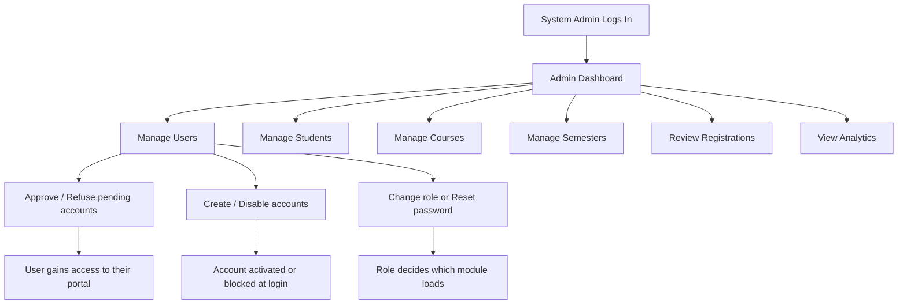

# Activity Diagram — System Admin Access Flow

## Purpose

This diagram shows how System Admin actions control access for every other module. The admin owns the account lifecycle (approve, create, disable, role changes, password resets). These actions decide who can log in and which portal each user reaches.

## Mermaid Diagram

## Explanation

The System Admin manages the identity layer of the system. Approving a pending account sets its role and activates it, which is what lets that user sign in. Changing a role re-routes the user to a different portal (student, instructor, academic staff, finance staff). Disabling an account blocks authentication, while admin accounts are protected from being deactivated so administration is never locked out.

## Result

This diagram shows the connection between System Admin work and every other module. It explains why each user can only reach the portal that the admin granted through the account workflow.
