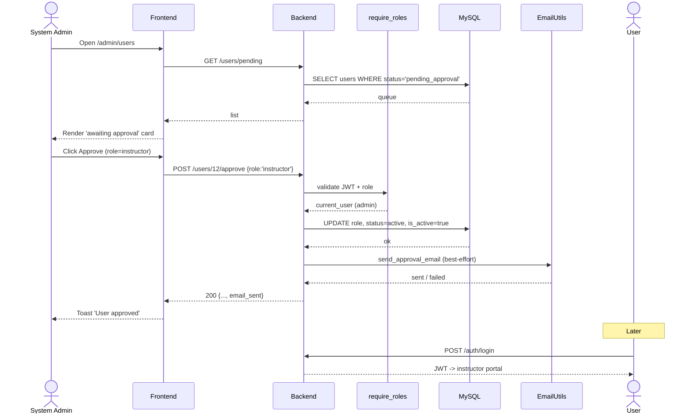
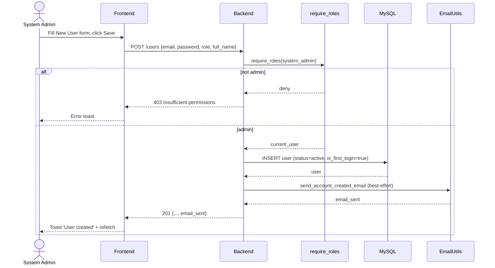
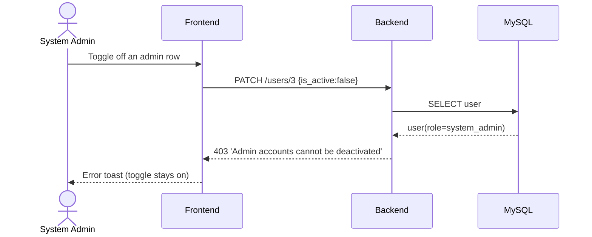
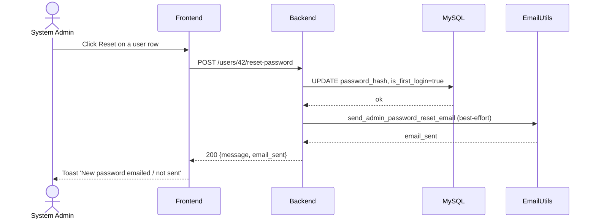
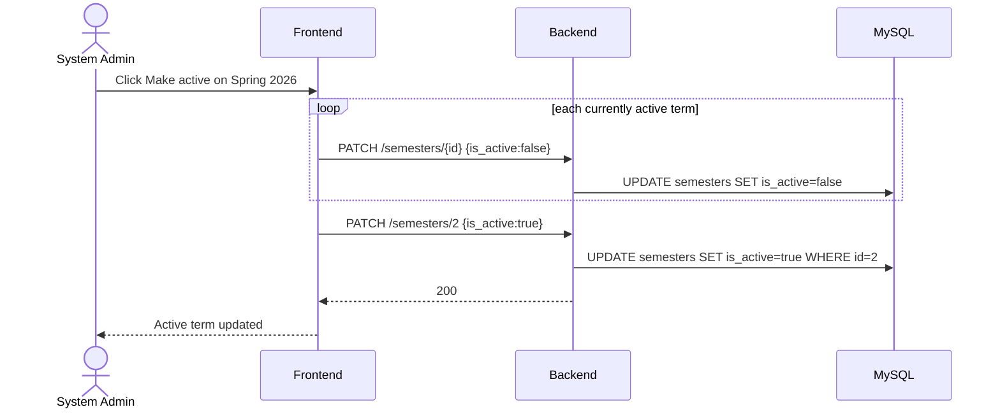

# System Admin — Sequence Diagrams

## S1 — Approve a pending account

## S2 — Create a user

## S3 — Disable an account (admin guard rejects)

## S4 — Reset a user's password

## S5 — Activate a semester

