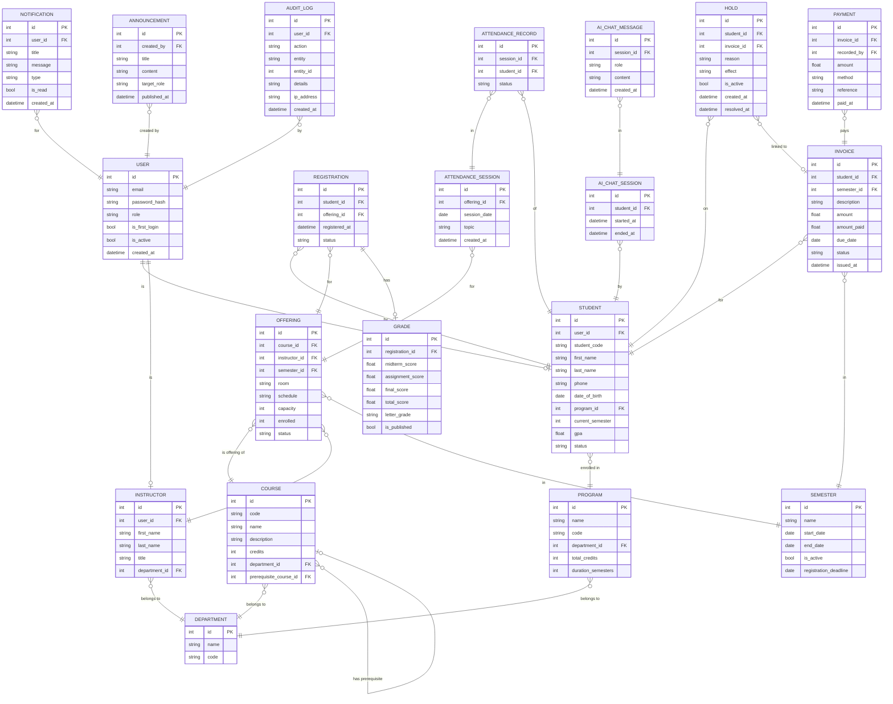

# Entity-Relationship Diagram

```mermaid
erDiagram
    USER {
        int id PK
        string email
        string password_hash
        string role
        bool is_first_login
        bool is_active
        datetime created_at
    }

    STUDENT {
        int id PK
        int user_id FK
        string student_code
        string first_name
        string last_name
        string phone
        date date_of_birth
        int program_id FK
        int current_semester
        float gpa
        string status
    }

    INSTRUCTOR {
        int id PK
        int user_id FK
        string first_name
        string last_name
        string title
        int department_id FK
    }

    DEPARTMENT {
        int id PK
        string name
        string code
    }

    PROGRAM {
        int id PK
        string name
        string code
        int department_id FK
        int total_credits
        int duration_semesters
    }

    COURSE {
        int id PK
        string code
        string name
        string description
        int credits
        int department_id FK
        int prerequisite_course_id FK
    }

    OFFERING {
        int id PK
        int course_id FK
        int instructor_id FK
        int semester_id FK
        string room
        string schedule
        int capacity
        int enrolled
        string status
    }

    SEMESTER {
        int id PK
        string name
        date start_date
        date end_date
        bool is_active
        date registration_deadline
    }

    REGISTRATION {
        int id PK
        int student_id FK
        int offering_id FK
        datetime registered_at
        string status
    }

    GRADE {
        int id PK
        int registration_id FK
        float midterm_score
        float assignment_score
        float final_score
        float total_score
        string letter_grade
        bool is_published
    }

    ATTENDANCE_SESSION {
        int id PK
        int offering_id FK
        date session_date
        string topic
        datetime created_at
    }

    ATTENDANCE_RECORD {
        int id PK
        int session_id FK
        int student_id FK
        string status
    }

    INVOICE {
        int id PK
        int student_id FK
        int semester_id FK
        string description
        float amount
        float amount_paid
        date due_date
        string status
        datetime issued_at
    }

    PAYMENT {
        int id PK
        int invoice_id FK
        int recorded_by FK
        float amount
        string method
        string reference
        datetime paid_at
    }

    HOLD {
        int id PK
        int student_id FK
        int invoice_id FK
        string reason
        string effect
        bool is_active
        datetime created_at
        datetime resolved_at
    }

    NOTIFICATION {
        int id PK
        int user_id FK
        string title
        string message
        string type
        bool is_read
        datetime created_at
    }

    ANNOUNCEMENT {
        int id PK
        int created_by FK
        string title
        string content
        string target_role
        datetime published_at
    }

    AUDIT_LOG {
        int id PK
        int user_id FK
        string action
        string entity
        int entity_id
        string details
        string ip_address
        datetime created_at
    }

    AI_CHAT_SESSION {
        int id PK
        int student_id FK
        datetime started_at
        datetime ended_at
    }

    AI_CHAT_MESSAGE {
        int id PK
        int session_id FK
        string role
        string content
        datetime created_at
    }

    USER ||--o| STUDENT : "is"
    USER ||--o| INSTRUCTOR : "is"

    STUDENT }o--|| PROGRAM : "enrolled in"
    PROGRAM }o--|| DEPARTMENT : "belongs to"
    COURSE }o--|| DEPARTMENT : "belongs to"
    COURSE }o--o| COURSE : "has prerequisite"
    INSTRUCTOR }o--|| DEPARTMENT : "belongs to"

    OFFERING }o--|| COURSE : "is offering of"
    OFFERING }o--|| INSTRUCTOR : "taught by"
    OFFERING }o--|| SEMESTER : "in"

    REGISTRATION }o--|| STUDENT : "by"
    REGISTRATION }o--|| OFFERING : "for"
    REGISTRATION ||--o| GRADE : "has"

    ATTENDANCE_SESSION }o--|| OFFERING : "for"
    ATTENDANCE_RECORD }o--|| ATTENDANCE_SESSION : "in"
    ATTENDANCE_RECORD }o--|| STUDENT : "of"

    INVOICE }o--|| STUDENT : "for"
    INVOICE }o--|| SEMESTER : "in"
    PAYMENT }o--|| INVOICE : "pays"
    HOLD }o--|| STUDENT : "on"
    HOLD }o--o| INVOICE : "linked to"

    NOTIFICATION }o--|| USER : "for"
    ANNOUNCEMENT }o--|| USER : "created by"

    AUDIT_LOG }o--|| USER : "by"

    AI_CHAT_SESSION }o--|| STUDENT : "by"
    AI_CHAT_MESSAGE }o--|| AI_CHAT_SESSION : "in"
```
