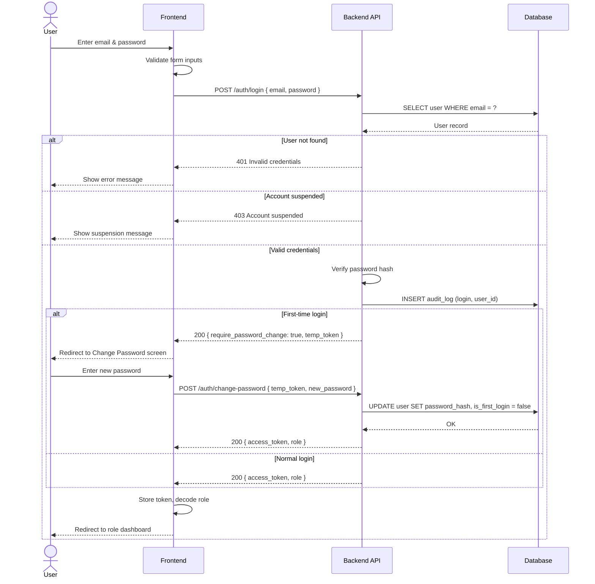
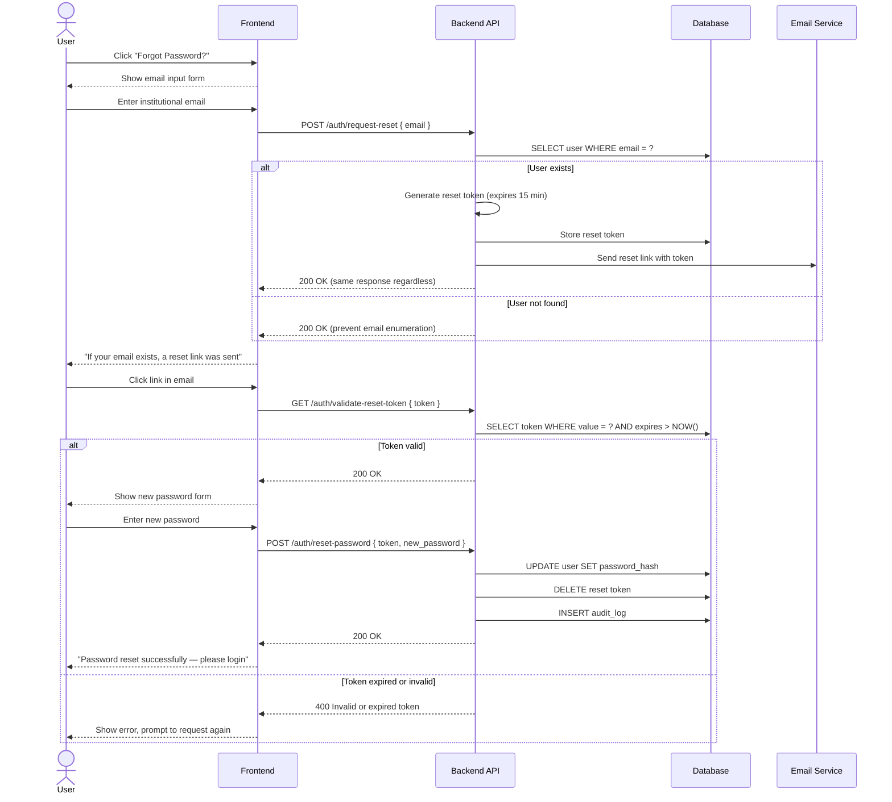

# Sequence Diagram — Login Flow

```mermaid
sequenceDiagram
    actor User
    participant FE as Frontend
    participant API as Backend API
    participant DB as Database

    User->>FE: Enter email & password
    FE->>FE: Validate form inputs

    FE->>API: POST /auth/login { email, password }
    API->>DB: SELECT user WHERE email = ?
    DB-->>API: User record

    alt User not found
        API-->>FE: 401 Invalid credentials
        FE-->>User: Show error message
    else Account suspended
        API-->>FE: 403 Account suspended
        FE-->>User: Show suspension message
    else Valid credentials
        API->>API: Verify password hash
        API->>DB: INSERT audit_log (login, user_id)

        alt First-time login
            API-->>FE: 200 { require_password_change: true, temp_token }
            FE-->>User: Redirect to Change Password screen
            User->>FE: Enter new password
            FE->>API: POST /auth/change-password { temp_token, new_password }
            API->>DB: UPDATE user SET password_hash, is_first_login = false
            DB-->>API: OK
            API-->>FE: 200 { access_token, role }
        else Normal login
            API-->>FE: 200 { access_token, role }
        end

        FE->>FE: Store token, decode role
        FE-->>User: Redirect to role dashboard
    end
```

# Sequence Diagram — Password Reset Flow

```mermaid
sequenceDiagram
    actor User
    participant FE as Frontend
    participant API as Backend API
    participant DB as Database
    participant Email as Email Service

    User->>FE: Click "Forgot Password?"
    FE-->>User: Show email input form
    User->>FE: Enter institutional email
    FE->>API: POST /auth/request-reset { email }
    API->>DB: SELECT user WHERE email = ?

    alt User exists
        API->>API: Generate reset token (expires 15 min)
        API->>DB: Store reset token
        API->>Email: Send reset link with token
        API-->>FE: 200 OK (same response regardless)
    else User not found
        API-->>FE: 200 OK (prevent email enumeration)
    end

    FE-->>User: "If your email exists, a reset link was sent"

    User->>FE: Click link in email
    FE->>API: GET /auth/validate-reset-token { token }
    API->>DB: SELECT token WHERE value = ? AND expires > NOW()

    alt Token valid
        API-->>FE: 200 OK
        FE-->>User: Show new password form
        User->>FE: Enter new password
        FE->>API: POST /auth/reset-password { token, new_password }
        API->>DB: UPDATE user SET password_hash
        API->>DB: DELETE reset token
        API->>DB: INSERT audit_log
        API-->>FE: 200 OK
        FE-->>User: "Password reset successfully — please login"
    else Token expired or invalid
        API-->>FE: 400 Invalid or expired token
        FE-->>User: Show error, prompt to request again
    end
```
