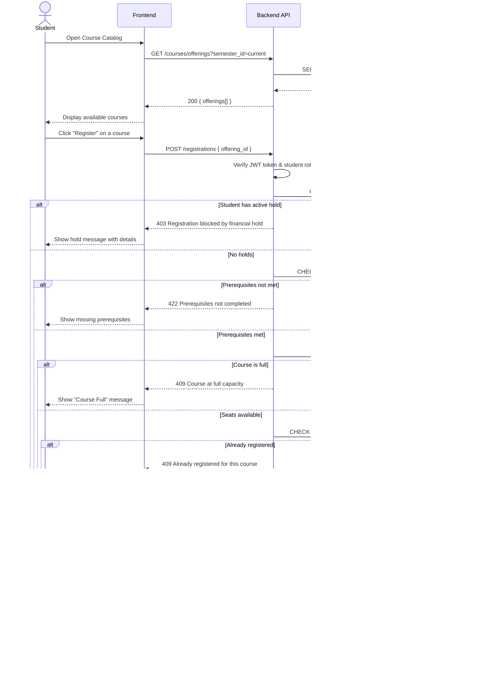
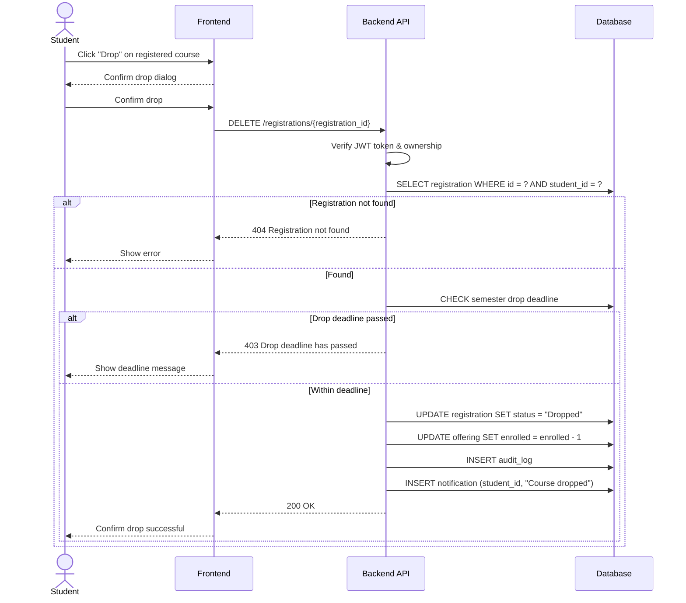
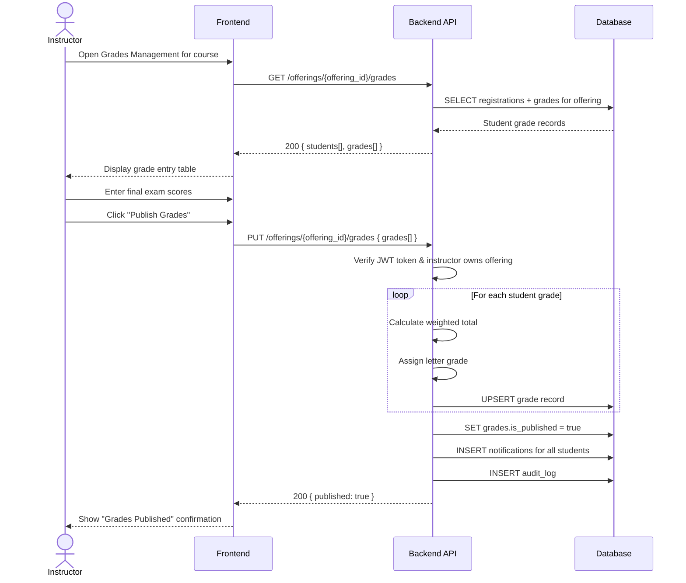

# Sequence Diagram — Course Registration Flow

```mermaid
sequenceDiagram
    actor Student
    participant FE as Frontend
    participant API as Backend API
    participant DB as Database

    Student->>FE: Open Course Catalog
    FE->>API: GET /courses/offerings?semester_id=current
    API->>DB: SELECT offerings with enrollment counts
    DB-->>API: Course list
    API-->>FE: 200 { offerings[] }
    FE-->>Student: Display available courses

    Student->>FE: Click "Register" on a course
    FE->>API: POST /registrations { offering_id }
    API->>API: Verify JWT token & student role

    API->>DB: CHECK financial holds (student_id)
    alt Student has active hold
        API-->>FE: 403 Registration blocked by financial hold
        FE-->>Student: Show hold message with details
    else No holds
        API->>DB: CHECK prerequisites (student_id, course_id)
        alt Prerequisites not met
            API-->>FE: 422 Prerequisites not completed
            FE-->>Student: Show missing prerequisites
        else Prerequisites met
            API->>DB: CHECK offering capacity
            alt Course is full
                API-->>FE: 409 Course at full capacity
                FE-->>Student: Show "Course Full" message
            else Seats available
                API->>DB: CHECK already registered (student_id, offering_id)
                alt Already registered
                    API-->>FE: 409 Already registered for this course
                    FE-->>Student: Show duplicate warning
                else Not registered
                    API->>DB: INSERT registration (student_id, offering_id)
                    API->>DB: UPDATE offering SET enrolled = enrolled + 1
                    API->>DB: INSERT audit_log
                    API->>DB: INSERT notification (student_id, "Registration confirmed")
                    API-->>FE: 201 { registration_id, status: "Approved" }
                    FE-->>Student: Show success confirmation
                    FE->>FE: Update course list (decrement seat count)
                end
            end
        end
    end
```

# Sequence Diagram — Course Drop Flow

```mermaid
sequenceDiagram
    actor Student
    participant FE as Frontend
    participant API as Backend API
    participant DB as Database

    Student->>FE: Click "Drop" on registered course
    FE-->>Student: Confirm drop dialog
    Student->>FE: Confirm drop

    FE->>API: DELETE /registrations/{registration_id}
    API->>API: Verify JWT token & ownership

    API->>DB: SELECT registration WHERE id = ? AND student_id = ?
    alt Registration not found
        API-->>FE: 404 Registration not found
        FE-->>Student: Show error
    else Found
        API->>DB: CHECK semester drop deadline
        alt Drop deadline passed
            API-->>FE: 403 Drop deadline has passed
            FE-->>Student: Show deadline message
        else Within deadline
            API->>DB: UPDATE registration SET status = "Dropped"
            API->>DB: UPDATE offering SET enrolled = enrolled - 1
            API->>DB: INSERT audit_log
            API->>DB: INSERT notification (student_id, "Course dropped")
            API-->>FE: 200 OK
            FE-->>Student: Confirm drop successful
        end
    end
```

# Sequence Diagram — Grade Submission Flow

```mermaid
sequenceDiagram
    actor Instructor
    participant FE as Frontend
    participant API as Backend API
    participant DB as Database

    Instructor->>FE: Open Grades Management for course
    FE->>API: GET /offerings/{offering_id}/grades
    API->>DB: SELECT registrations + grades for offering
    DB-->>API: Student grade records
    API-->>FE: 200 { students[], grades[] }
    FE-->>Instructor: Display grade entry table

    Instructor->>FE: Enter final exam scores
    Instructor->>FE: Click "Publish Grades"

    FE->>API: PUT /offerings/{offering_id}/grades { grades[] }
    API->>API: Verify JWT token & instructor owns offering

    loop For each student grade
        API->>API: Calculate weighted total
        API->>API: Assign letter grade
        API->>DB: UPSERT grade record
    end

    API->>DB: SET grades.is_published = true
    API->>DB: INSERT notifications for all students
    API->>DB: INSERT audit_log
    API-->>FE: 200 { published: true }
    FE-->>Instructor: Show "Grades Published" confirmation
```
