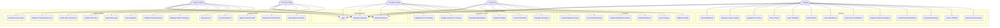

# Use Case Diagram

```mermaid
flowchart TB
    subgraph System["Campus Information System"]

        subgraph AUTH["Authentication"]
            UC1(Login)
            UC2(Change Password)
            UC3(Reset Password)
        end

        subgraph STUDENT_UC["Student"]
            UC10(View Dashboard)
            UC11(Browse Course Catalog)
            UC12(Register for Course)
            UC13(Drop Course)
            UC14(View Timetable)
            UC15(View Grades)
            UC16(View Attendance)
            UC17(View Invoice & Balance)
            UC18(Request Financial Support)
            UC19(View Recommendations)
            UC20(View Risk Warning)
            UC21(Use AI Chatbot)
            UC22(View Announcements)
        end

        subgraph INSTRUCTOR_UC["Instructor"]
            UC30(View Assigned Courses)
            UC31(View Student Roster)
            UC32(Create Attendance Session)
            UC33(Mark Attendance)
            UC34(Enter Grades)
            UC35(Publish Grades)
        end

        subgraph ACADEMIC_UC["Academic Staff"]
            UC40(Manage Course Catalog)
            UC41(Assign Instructor to Course)
            UC42(Manage Registrations)
            UC43(View All Grades)
            UC44(View All Students)
            UC45(Manage Semesters)
        end

        subgraph FINANCE_UC["Finance Staff"]
            UC50(Issue Invoice)
            UC51(Record Payment)
            UC52(Apply Financial Hold)
            UC53(Release Financial Hold)
            UC54(View Payment History)
        end

        subgraph ADMIN_UC["System Admin"]
            UC60(Create User Account)
            UC61(Activate / Suspend Account)
            UC62(Reset User Password)
            UC63(Assign User Role)
            UC64(View Audit Logs)
            UC65(View Analytics)
            UC66(Publish Announcements)
            UC67(Manage System Settings)
        end

    end

    STUDENT(["👤 Student"])
    INSTRUCTOR(["👤 Instructor"])
    ACADEMIC(["👤 Academic Staff"])
    FINANCE(["👤 Finance Staff"])
    ADMIN(["👤 System Admin"])

    STUDENT --> UC1 & UC2 & UC3
    STUDENT --> UC10 & UC11 & UC12 & UC13
    STUDENT --> UC14 & UC15 & UC16
    STUDENT --> UC17 & UC18 & UC19 & UC20 & UC21 & UC22

    INSTRUCTOR --> UC1 & UC2 & UC3
    INSTRUCTOR --> UC30 & UC31 & UC32 & UC33 & UC34 & UC35

    ACADEMIC --> UC1 & UC2 & UC3
    ACADEMIC --> UC40 & UC41 & UC42 & UC43 & UC44 & UC45

    FINANCE --> UC1 & UC2 & UC3
    FINANCE --> UC50 & UC51 & UC52 & UC53 & UC54

    ADMIN --> UC1 & UC2 & UC3
    ADMIN --> UC60 & UC61 & UC62 & UC63 & UC64 & UC65 & UC66 & UC67
```
